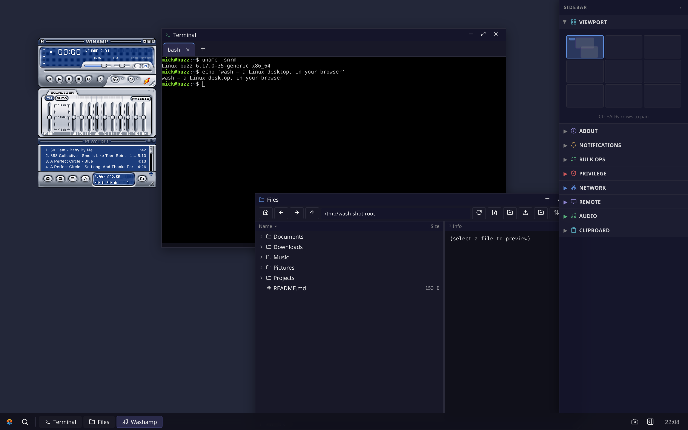
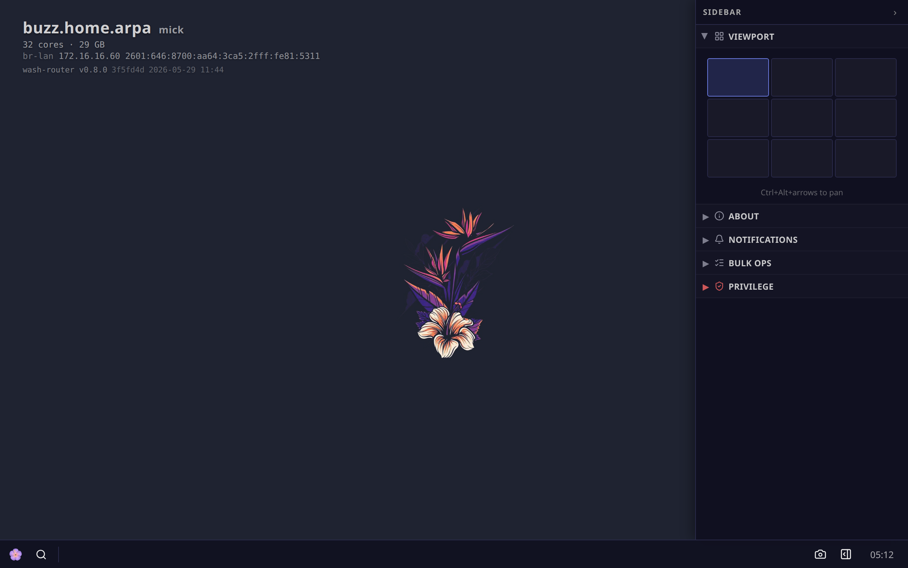
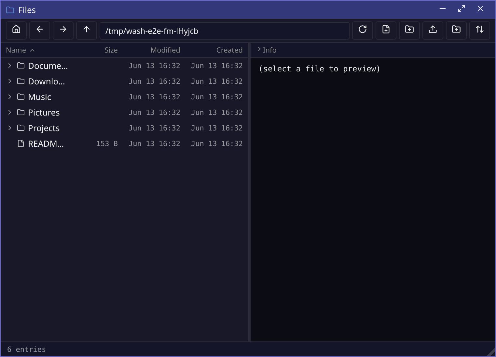
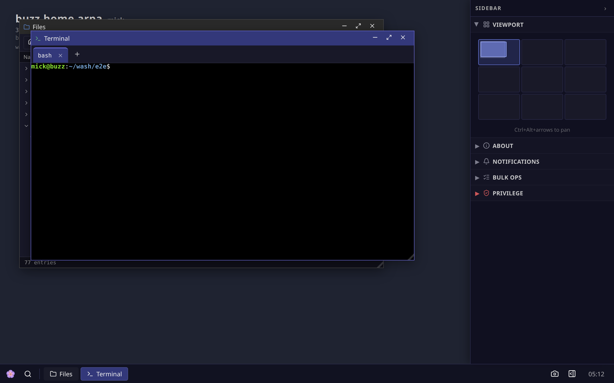
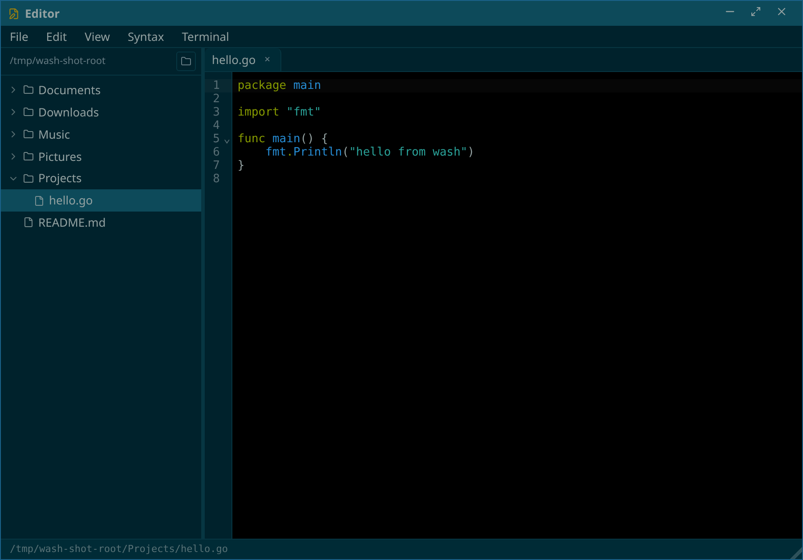
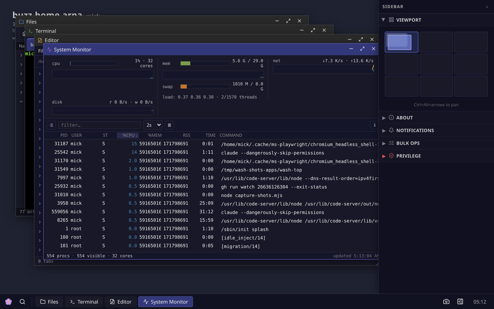
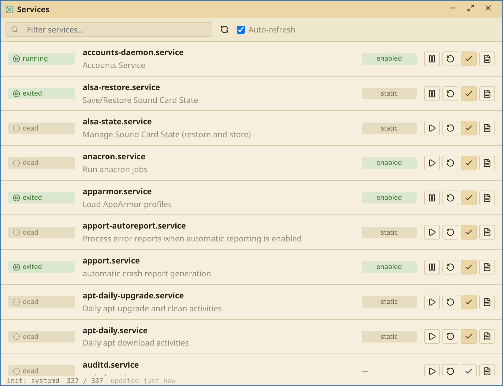
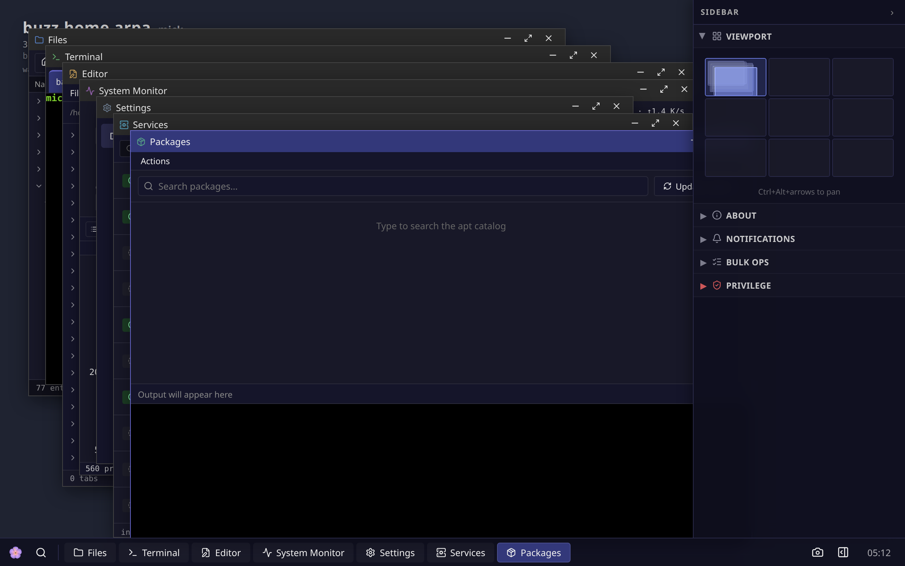
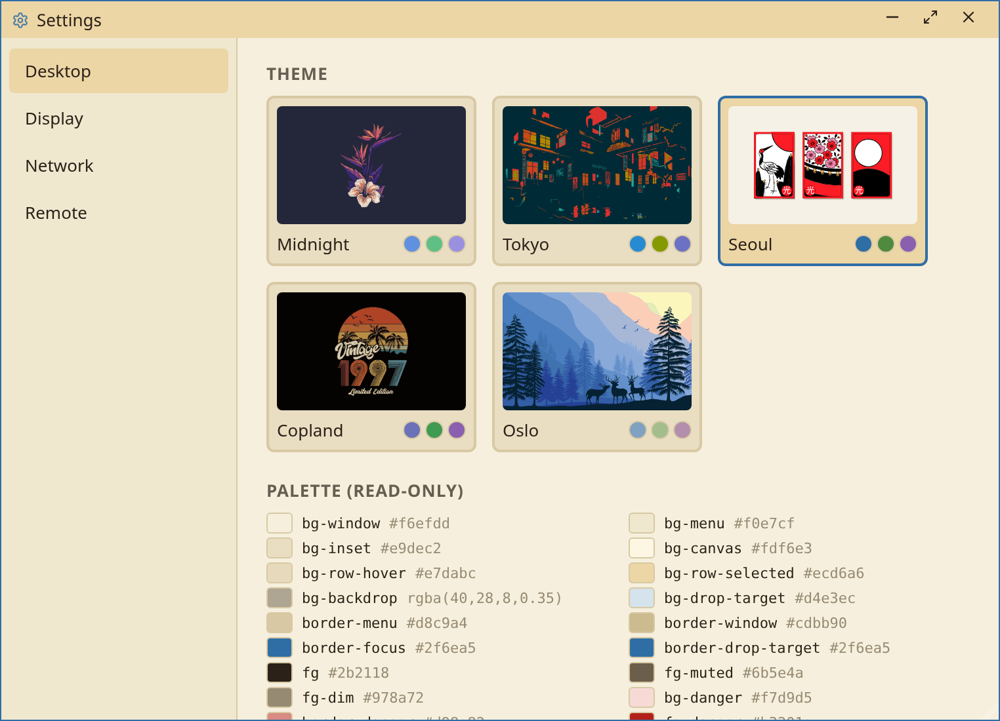

# wash — Web Application SHell

**A real Linux desktop, delivered to a browser tab over a single
WebSocket, from one static Go binary that runs anywhere — a laptop, a
home server, a Raspberry Pi, or a RISC-V emulator compiled to WASM.**

> 🖥️ **Try it now, no install:** **[sirmick.github.io/wash](https://sirmick.github.io/wash/)**
> — a full wash desktop running on *real* Linux (Linux 6.6 LTS riscv64
> + busybox userland) inside a WASM-compiled RISC-V emulator, booting
> in ~3 seconds. The whole thing is ~24 MiB of static assets served
> straight from GitHub Pages — no backend, no relay, no account.



wash is **not** pixel-streamed remote desktop (no VNC, no RDP, no video
codec). Every surface is HTML the desktop owns and renders locally;
only events and file bytes cross the wire. It is a traditional
floating-window environment — taskbar, launcher, real draggable
windows, a workspace pager, a system sidebar — where the window
manager runs *in the browser* and each application is an independent,
one-file program that a transport-only **router** supervises.

License: **AGPL-3.0**. Current version: **0.8.0**.

---

## Table of contents

- [Why wash](#why-wash)
- [Screenshots](#screenshots)
- [Apps](#apps)
- [CLI tools](#cli-tools)
- [Footprint — how little it uses](#footprint--how-little-it-uses)
- [Quickstart](#quickstart)
- [Connecting](#connecting)
- [Development loop](#development-loop)
- [Running the browser demo locally](#running-the-browser-demo-locally)
- [Packaging (deb / rpm / apk)](#packaging-deb--rpm--apk)
- [Router flags](#router-flags)
- [Trust & privilege model](#trust--privilege-model)
- [Architecture](#architecture)
- [Wire protocol](#wire-protocol)
- [Capabilities](#capabilities)
- [Filesystem](#filesystem)
- [Repository layout](#repository-layout)
- [Documentation](#documentation)
- [Testing](#testing)

---

## Why wash

A desktop environment is normally a heavy, machine-local stack. wash
turns it into a **single static binary plus a browser**:

- **One binary, zero dependencies.** `CGO_ENABLED=0`, statically
  linked, cross-compiles to amd64 / arm64 / riscv64 / mips. Drop it on
  a box and run it. It can even ship as a **multicall binary** — one
  `wash` executable with busybox-style `wash-<app>` symlinks, so the
  whole desktop is *one* file.
- **HTML, not pixels.** The browser renders the UI. The wire carries
  events and file bytes, not framebuffers — so it stays responsive
  over slow links and uses a fraction of the bandwidth of VNC/RDP.
- **Apps are isolated processes.** Each app is a Go backend
  event-loop with an embedded web-component bundle. The router
  supervises them, mux'es their channels, and **never interprets
  their payloads** — it's pure transport.
- **It's the real machine.** Backends run as your Unix user and
  syscall directly: the file manager calls `stat(2)`, the process
  monitor reads `/proc`, the package manager drives `apt`/`dnf`/`apk`,
  the service manager drives `systemd`/`openrc`/`procd`. No
  reimplemented userland.
- **Tiny.** The router idles around **25 MB RSS**; a full desktop
  session — router plus a dozen app processes — sits near **100 MB
  RSS** total. The browser demo runs an *entire Linux system* in a
  64 MB emulated machine.

---

## Screenshots

| | |
|---|---|
| **Desktop** — wallpaper, system banner, workspace pager + sidebar widgets, taskbar | **Files** — tree + preview, watch, mutations |
|  |  |
| **Terminal** — tabbed xterm.js over local PTYs | **Editor** — CodeMirror 6, tree, tabs, embedded terminal |
|  |  |
| **System Monitor** — live CPU / mem / net / disk + process table from `/proc` | **Services** — systemd / openrc / procd units, start/stop/enable |
|  |  |
| **Packages** — apt / dnf / apk front-end | **Settings** — wallpaper, clock, taskbar |
|  |  |

---

## Apps

Each app lives in `apps/<name>/`: the Go backend under `be/`, the web
component bundle under `fe/`. The Makefile builds the FE bundle and
**embeds it into the BE binary**, so an app is genuinely one file. The
session app autoboots when a browser connects; the rest are launched
by the user (launcher menu, `wash-launch`) or by other apps holding
the `spawn` capability.

A **surface** declares how an app presents: `window` (a normal
window), `desktop` (the chrome itself), or `background` (a headless
service, no window).

| App | ID | Surface | What it does |
|---|---|---|---|
| **session** | `com.wash.session` | desktop | The desktop chrome — taskbar, launcher, wallpaper, workspace pager, system banner, and the right-hand sidebar widget host. Autoboots on connect. Watches `~/.config/wash/desktop.json` and live-reloads. Acts as the gateway that subscribes to the background services and feeds their state to the sidebar widgets. |
| **about** | `com.wash.about` | window | Build / router / host facts plus a live Go-runtime process table polled from the router. The launch-flow smoke test. |
| **term** | `com.wash.term` | window | Terminal emulator — tabbed xterm.js over local PTYs (`internal/pty`). `--exec ARGS` runs a one-shot command; `--login` starts a login shell (used by the Root Terminal). |
| **fm** | `com.wash.fm` | window | File manager — tree + preview. List, read, write, rename, delete, chmod/chown, symlink, live `fswatch`. Cut/copy/paste synced across windows via the router clipboard. Sandboxable with `--fs-root`. |
| **edit** | `com.wash.edit` | window | Text editor — CodeMirror 6 with a sidebar tree, tabs, an embedded terminal pane, and a file picker. "Open in fm" spawns the file manager (uses `spawn`). |
| **top** | `com.wash.top` | window | System monitor — reads `/proc` directly, no daemon. Live CPU / memory / network / disk, per-process detail, and signal/kill. Pauses its stream while minimized. |
| **services** | `com.wash.services` | window | Init-system manager — detects systemd / openrc / procd, lists units, and runs start/stop/restart/enable/disable through wash-priv. Deep-links into the matching log viewer for a unit. |
| **journal** | `com.wash.journal` | window | systemd-journald viewer — streams parsed `journalctl` JSON with unit / priority / time filters. Tries unprivileged first; offers "Read with root" via wash-priv on permission denied. |
| **syslogs** | `com.wash.syslogs` | window | Classic `/var/log/*.log` viewer — `tail -F` one file at a time. The non-systemd sibling of journal; same privilege-escalation fallback. |
| **packages** | `com.wash.packages` | window | Package-manager front-end — auto-detects apt / dnf / apk. Search, install, remove, upgrade; mutations stream into an embedded terminal through wash-priv. |
| **settings** | `com.wash.settings` | window | Desktop preferences — wallpaper, clock format, taskbar position. Writes `~/.config/wash/desktop.json` atomically; session fswatches and reloads. |
| **bulk** | `com.wash.bulk` | background | Singleton job queue + worker for recursive delete / move / copy. fm enqueues jobs; conflicts block until the user resolves them in the sidebar widget. |
| **notify** | `com.wash.notify` | background | Notification service — any app posts notifications; notify keeps capped history and feeds the sidebar widget; the router also fans them out as transient toasts. |
| **priv** | `com.wash.priv` | background | The single privilege primitive. Other apps ask priv to run / spawn a registered binary as root; the user approves in a queue UI; the sudo password lives only in BE memory with an idle timeout. Windows backed by root wear a red **ROOT** stripe. |
| **test** | `com.wash.test` | window | E2E target — hidden from the catalog unless `--show-hidden`. Drives the Playwright suite. Built with `make test-app`. |

**Cross-app wiring:** services → journal/syslogs (log deep-links);
packages / services / journal / syslogs → priv (privileged actions);
fm → bulk (file jobs); session → notify / bulk / priv (sidebar
widgets). All of it travels as router-attested `app_msg` — apps never
hold references to each other, only the router does.

## CLI tools

These are CLIs (no FE, no window) but they're how you drive a running
wash from a shell. Both land in `out/` after a normal `make`.

| Tool | What it does |
|---|---|
| **wash-launch** | `wash-launch <app-id>` spawns an app from the terminal. `wash-launch msg <instance> <json>` relays an `app_msg`, optionally awaiting a reply. Finds the router via `WASH_CONTROL_SOCKET`. |
| **wash-sudo** | A sudo-shaped CLI for wash-priv: `wash-sudo cmd args…`. Approval + password happen in the browser, never in the terminal. `--window` opens a root wash-term; `--app <id>` spawns a registered app as root. |
| **wash-login** | The multi-user front door (see [Connecting](#connecting)) — browser auth, per-user session routers. |

---

## Footprint — how little it uses

wash is built to run on the kind of hardware where a conventional
desktop won't fit.

| Thing | Cost |
|---|---|
| Idle router (no shell connected) | **~25 MB RSS** |
| A single app backend process | ~7–10 MB RSS |
| Full desktop session (router + ~12 app processes) | **~100 MB RSS** total |
| Router binary on disk (amd64, static, `-s -w`) | ~7.5 MB |
| Multicall `wash` binary in the demo VM (riscv64) | **~11 MB** — *all* apps + router + login |
| Whole browser demo (kernel + rootfs + emulator + UI) | **~24 MiB** static assets |
| Emulated machine the demo's full Linux system runs in | 64 MB RAM |

The wire carries events and file bytes, not video — bandwidth scales
with what you actually do, not with screen size or frame rate.

---

## Quickstart

Prerequisites: **Go ≥ 1.25** (see `go.mod`), **pnpm**, **make**, and
optionally **brotli** for smaller embedded bundles. Linux is the
target; macOS works for development but not every app (wash-priv, the
privilege primitive, expects Linux semantics).

```bash
git clone https://github.com/sirmick/wash.git
cd wash
make                 # builds every binary into ./out/
./out/wash-router    # serves http://localhost:11000/
```

Open **`http://localhost:11000/`**. The session app boots
automatically; click the launcher (bottom-left) to open apps.

Prefer one file instead of twenty? Build the **multicall** binary:

```bash
make multicall       # ./out/wash + wash-<app> symlinks beside it
./out/wash-router    # the symlink dispatches into the one binary
```

The `build.sh` / `run.sh` / `test.sh` scripts wrap these with handy
flags (`--standalone` / `--multicall` / `--both`, `--fm-seed`,
`--no-build`, parallel jobs); run any of them with `--help`.

---

## Connecting

wash has two front ends, for two situations.

### Single-user (localhost / dev)

`wash-router` serves the shell and the WebSocket itself on
`0.0.0.0:11000`. Open `http://localhost:11000/`. There is **no
authentication** — anyone who can reach the socket gets the desktop —
so bind it to loopback and reach it over an SSH tunnel or Tailscale.
The router prints a warning if `--listen` isn't loopback. This is the
mode the Quickstart above starts.

### Multi-user (production)

`wash-login` is a small privileged front door that authenticates
browser users and gives each one isolated session(s):

```bash
# Behind a TLS terminator (nginx / Caddy / Tailscale-serve):
sudo setcap cap_setuid,cap_setgid,cap_kill+ep /usr/bin/wash-login   # or: make wash-login-deploy
wash-login --cookie-secure                                          # default :11000
```

1. The browser hits `/login`; wash-login authenticates against the
   **system's real login** by running `su -c true <user>` over a PTY —
   so PAM / LDAP / SSSD / Kerberos all work, and wash never
   reimplements crypto.
2. On success it mints an **HMAC-signed `wash_session` cookie**
   (HttpOnly, SameSite=Strict).
3. On `/ws` it finds or **spawns a per-user `wash-router`** running as
   that user's uid, then hands the raw socket to it via `SCM_RIGHTS`
   and steps out of the data path. The kernel enforces isolation
   between users.
4. Each user can run multiple named sessions; a picker appears when
   more than one exists. Sessions are discovered by walking `/proc`,
   so wash-login holds no per-session state and is restart-safe.

wash-login speaks plain HTTP — **always put TLS in front of it** (it
needs `CAP_SETUID`/`CAP_SETGID`/`CAP_KILL`, nothing more). Full
design, flags, and the `/run/wash/<uid>/sessions/` layout are in
[docs/MULTIUSER.md](docs/MULTIUSER.md).

---

## Development loop

```bash
make dev        # vite at :5173 (HMR), router at :11000, /ws proxied
```

Open `http://localhost:5173/`. Edits under `web/shell/src/`
hot-reload. Edits to Go sources or app FE bundles need a rebuild — or
run the router in watch mode:

```bash
./out/wash-router --dev
```

`--dev` watches the app binaries. Rebuild an app (`make wash-fm`, say)
and the router kills running instances and pushes a `shell.reload` so
the new bundle takes over live. Rebuilding the router itself triggers
a self-re-exec.

---

## Running the browser demo locally

The thing hosted at [sirmick.github.io/wash](https://sirmick.github.io/wash/)
lives in [`wash-vm/`](wash-vm/): wash running inside a **real** Linux
VM (upstream Linux 6.6 LTS riscv64 + OpenSBI + a buildroot/musl
rootfs) on **TinyEMU compiled to WASM**, talking to the browser over a
multiport virtio-console. Everything builds in Docker — no host
cross-toolchain required.

```bash
# 1. Build the VM artifacts (kernel + firmware + rootfs + wasm). Docker only.
make -C wash-vm/image all      # ~5–10 min cold; cached after

# 2. Build the browser shell bundle.
pnpm -F @wash/shell build

# 3. Start the demo dev server (Vite + a /ws bus).
cd wash-vm/web && node server/server.mjs    # http://localhost:5180
```

Open `http://localhost:5180`. To deploy it statically (GitHub Pages,
S3, Cloudflare), `vite build --base=/your-path/` the host page and
ship `wash-vm/web/dist/` — the recipe and the static-hosting caveats
are in [`wash-vm/README.md`](wash-vm/README.md). CI rebuilds and
publishes it on every push to `main`
([`.github/workflows/demo.yml`](.github/workflows/demo.yml)), pulling
prebuilt kernel/firmware/wasm blobs from a rolling release so the
build stays fast.

---

## Packaging (deb / rpm / apk)

### Install the latest release

Every tagged release ships native packages for all four distros.
These URLs always resolve to the latest:

```bash
# Ubuntu / Debian
wget https://github.com/sirmick/wash/releases/latest/download/wash-ubuntu-24.04-amd64.deb
sudo apt install ./wash-ubuntu-24.04-amd64.deb

wget https://github.com/sirmick/wash/releases/latest/download/wash-debian-12-amd64.deb
sudo apt install ./wash-debian-12-amd64.deb

# Fedora
sudo dnf install https://github.com/sirmick/wash/releases/latest/download/wash-fedora-40-amd64.rpm

# Alpine
wget https://github.com/sirmick/wash/releases/latest/download/wash-alpine-3.21-amd64.apk
sudo apk add --allow-untrusted ./wash-alpine-3.21-amd64.apk

# OpenWRT (binary tarball — extract to /usr/bin)
wget https://github.com/sirmick/wash/releases/latest/download/wash-openwrt-24.10.6-x86_64.tgz
sudo tar -xzf wash-openwrt-24.10.6-x86_64.tgz -C /usr/bin
```

All five are stable filenames — they don't include the version. The
release page at <https://github.com/sirmick/wash/releases/latest> has
the same downloads if you'd rather click than `wget`.

### Build from source

```bash
./packaging/run_matrix.sh                       # all rows → dist/packages/<tag>/
WASH_PKG_VERSION=0.8.0 ./packaging/run_matrix.sh # pin the version
```

Each row does a two-stage Docker build: it builds the package
(`dpkg-buildpackage` / `rpmbuild` / `abuild`) from a source tarball,
then installs it into a *fresh* image and runs smoke tests, the
distro-integration tests, and a boot check. Packaging sources live in
`debian/`, `rpm/wash.spec`, and `alpine/APKBUILD`; the package installs
the `wash-*` binaries into `/usr/bin` and creates the `wash` group +
`wash-system` user for the multi-user front door. CI runs the same
matrix and attaches the artifacts to tagged releases
([`.github/workflows/matrix.yml`](.github/workflows/matrix.yml)). The
distro backends and install layout are documented in
[docs/MATRIX.md](docs/MATRIX.md).

---

## Router flags

```
--listen HOST:PORT          # default 0.0.0.0:11000
--apps-dir DIR[:DIR…]       # default: dir of the wash-router binary
--no-session                # don't autoboot wash-session
--initial-app APP_ID        # spawn this app full-screen ("kiosk")
--fs-root PATH              # sandbox every fs-touching app under PATH
--show-hidden               # include manifest.hidden apps in the catalog
--control-socket PATH       # default /tmp/wash-<uid>.sock (or "none")
--screenshot-dir DIR        # default /tmp/wash-screenshots (or "none")
--dev                       # watch binaries; auto-reload on rebuild
--listen-unix PATH          # ctl socket for SCM_RIGHTS handoff (multi-user)
--name NAME                 # human-readable session name (multi-user)
--idle-timeout DUR          # self-exit when idle (default 30m under --listen-unix)
--version
```

---

## Trust & privilege model

> **Read this before binding to anything other than localhost.**

The bare `wash-router` is single-principal: the router and the apps it
spawns all run as one trusted Unix user, on a localhost-trust
boundary. There is **no authentication beyond "you can reach the
socket."** Bind to `127.0.0.1` and expose via SSH tunnel or Tailscale;
the router warns when `--listen` isn't loopback. For real multi-user
access, front it with [`wash-login`](#multi-user-production), which
gives each browser user a session router under their own uid.

The **browser side has no ambient authority** — every action funnels
through a router or app process; the FE can't touch the filesystem or
spawn anything on its own. **wash-priv** is the single place a sudo
password may live (BE memory only, idle timeout, cleared on refresh),
and every window whose backing process runs as root — or is wash-priv
itself — wears a red **ROOT** stripe so privilege is always visible.

---

## Architecture

Three ideas carry the whole design (full rationale and the locked
decisions are in [docs/ARCHITECTURE.md](docs/ARCHITECTURE.md)):

**1. The router is a transport, not a kernel.** It muxes channels
between processes, enforces flow control, and relays frames verbatim.
It **never parses an app's payloads** — all domain semantics live in
the app's BE and the browser shell. That's why the router stays tiny
and apps can't be coupled through it.

**2. The desktop is itself an app.** `wash-session` (surface =
`desktop`) draws the taskbar, launcher, wallpaper, pager, and sidebar.
The **window manager runs in the browser** but state is
server-authoritative: the router owns geometry, z-order, and focus,
and every shell observes it via a `session.snapshot` on connect plus
`session.patch` deltas. Reconnect a tab and the desktop is exactly as
you left it.

**3. Apps are one-file processes.** A Go event-loop backend with an
embedded web-component bundle. The **backend is the only thing with
syscalls**; the frontend has zero OS authority. The app's FE↔BE link
is the one place its own semantics live. Apps present on one of three
surfaces — `window`, `desktop`, `background` — and declare
[capabilities](#capabilities) the router enforces.

```
        browser tab                         host process tree
  ┌───────────────────────┐         ┌──────────────────────────────┐
  │  shell runtime (WM)    │         │  wash-router  (transport)     │
  │   ├ wash-session FE    │◀──WS──▶ │   ├ mux channels / QoS        │
  │   ├ wash-fm FE         │  frames │   ├ server-authoritative WM   │
  │   ├ wash-term FE       │         │   ├ control socket            │
  │   └ …                  │         │   └ serves shell + bundles    │
  └───────────────────────┘         │        │ unix-socket frames    │
                                     │   ┌────┴─────────────────┐    │
                                     │   ▼      ▼       ▼        ▼    │
                                     │ session  fm   term  …  priv   │  ← Go BE
                                     │ (each syscalls as the user)   │
                                     └──────────────────────────────┘
```

A deeper code map — what lives where, the SDK callbacks, the
channel-binding registry, bundle delivery, the control socket — is in
[docs/INTERNALS.md](docs/INTERNALS.md).

### The SDK

App authors get `internal/sdk`: `sdk.Main(&sdk.AppDef{…})` does the
manifest probe, handshake, and event loop; callbacks
(`OnReady`, `OnMapped`, `OnAppMsg`, `OnCloseRequested`, …) deliver
window and message events. On top sit a typed message **bus** (request
/ ok / err by `kind`, plus cross-app `Call`), a **StateService**
(subscribe-with-snapshot, used by bulk / notify / priv), and
`EnableFilePicker` (wires the shared `<FilePicker>` to the host BE's
own `fs.*` handlers).

## Wire protocol

Two transports, one frame format: **WebSocket** (browser ↔ router) and
a **Unix socket** (app ↔ router). A frame is a fixed 8-byte big-endian
header + payload:

```
┌────────┬──────────────────┬──────────────┬───────────────┐
│ flags  │   channel-id      │   length     │   payload     │
│  1 B   │     3 B (24-bit)   │  4 B (32-bit) │  ≤ 16 MiB     │
└────────┴──────────────────┴──────────────┴───────────────┘
   flags: bit0 = END (message boundary) · bits1–2 = QoS class
```

Channels carry different disciplines:

- **Channel 0 — control** (JSON): `identity` handshake, channel
  open/close, errors.
- **Channel 1 — event** (JSON): window events, `app_msg`, `spawn`,
  clipboard, `app_state`.
- **Channels 2+ — raw** (opaque bytes): PTY streams, file content,
  app-owned byte streams.

**Handshake:** the app sends `{"t":"identity","app_id":…,"proto":1}`
on channel 0; the router replies `identity.ack` with an
`instance_id`, `window_id`, and a `session` bag (e.g. the `--fs-root`
sandbox). **Cross-app messaging** rides `app_msg` with a
**router-attested** `from` field — the only way apps talk, and they
can't forge a sender.

**QoS:** the two class bits split frames into **Interactive**
(keystrokes, pointer, focus — drained first) and **Bulk** (PTY
output, file replies, log lines). The router runs strict-priority
per-class queues plus FE→router **credit windows**, so a
`cat 100MB` in one terminal can't head-of-line-block keystrokes in
another. Full spec in [docs/WIRE.md](docs/WIRE.md); QoS detail in
[docs/QOS.md](docs/QOS.md).

## Capabilities

Apps declare capabilities in their manifest; the router enforces them:

- **`spawn`** — may call `SpawnRequest(app_id)` to launch other apps.
  Held by `session`, `edit`, `services`. The router refuses spawn
  requests from apps that don't declare it.
- **`prepare_spawn`** — may call `PrepareSpawn(app_id)` to have the
  router mint a pending-attach record (instance_id + token) for a
  child the app forks itself (e.g. wash-priv wrapping a binary in
  sudo). Held by `priv`.

Reserved app ids (currently just `com.wash.priv`) are served **only**
from a uid-0-owned binary or one under a declared trusted dir
(`--dev` trusts the apps dir; `WASH_TRUSTED_APPS_DIRS` declares
specific paths).

## Filesystem

Apps that touch the filesystem (fm, edit, settings, bulk) run as the
user and **syscall directly** — there is no router-side fs service.
`internal/fs` provides the read accessor and a sandboxed `Confine`;
`internal/fswatch` wraps fsnotify with refcounted per-path
subscriptions. The router ships the `--fs-root` sandbox in the
handshake `Session` bag; apps that honor it `Confine` every
path-taking operation. With no root, apps are unconfined.
`@wash/ui`'s `<FilePicker>` works in any app whose BE calls
`sdk.EnableFilePicker(c)`.

## Repository layout

```
cmd/                wash (multicall), wash-router, wash-login,
                    wash-launch, wash-sudo, wash-priv-fakesudo
apps/<name>/be,fe   each app: Go backend + embedded web-component bundle
internal/
  wire/             frame codec, transports, message types
  router/           router + WM state + control socket + HTTP
  runner/           per-binary entrypoints (router, login, launch)
  login/            multi-user auth, /proc session registry, picker
  sdk/              app SDK (handshake, dispatch, bus, state, filepicker)
  fs/  fswatch/     read accessor + sandbox; refcounted fsnotify
  bulkops/          queue + worker for wash-bulk
  pty/  proc/       PTY sessions; /proc readers for top
  loopback/         in-memory transport for end-to-end tests
web/
  shell/            browser shell runtime (WM, WS client)
  lib/              @wash/ui — shared web components + FilePicker
wash-vm/            the in-browser RISC-V Linux demo (kernel/rootfs/wasm/host)
wash-display/       native X/Wayland compositor (C++/CMake, optional) — see its README
packaging/ debian/ rpm/ alpine/    distro package builds
e2e/                Playwright suite
docs/               see below
```

## Documentation

| Doc | Covers |
|---|---|
| [ARCHITECTURE.md](docs/ARCHITECTURE.md) | Intent, constraints, the locked design decisions. |
| [WIRE.md](docs/WIRE.md) | The wash wire protocol — framing, channel disciplines, message vocabulary. |
| [QOS.md](docs/QOS.md) | Priority classes, the strict-priority scheduler, credit windows. |
| [INTERNALS.md](docs/INTERNALS.md) | Code map: what lives where, how the pieces fit, what the SDK gives you. |
| [MULTIUSER.md](docs/MULTIUSER.md) | wash-login: browser auth, per-user routers, SCM_RIGHTS handoff, sessions. |
| [MATRIX.md](docs/MATRIX.md) | Distro packaging — apt/dnf/apk backends, the package matrix, install layout. |
| [TINYEMU.md](docs/TINYEMU.md) | The WASM RISC-V emulator: kernel format, shims, debug loop. |
| [DISPLAY.md](docs/DISPLAY.md) | The native X/Wayland compositor (`wash-display`): build reality, capture pipeline, wire client. |
| [NET.md](docs/NET.md) | Networking app + privileged daemon (`wash-net`/`wash-netd`): UCI-shaped model, backends. |
| [PLAN.md](docs/PLAN.md) | The v1 plan this is built against. |
| [TECH_DEBT.md](docs/TECH_DEBT.md) / [AUDIT.md](docs/AUDIT.md) | Known debt and a code-quality audit. |

## Building & testing each part

wash covers a lot of ground; each part builds and tests on its own. The
top-level `./build.sh` / `./test.sh` (both take `--help`) wrap the common
flows, but you can also drive any single subsystem directly:

| Part | Build | Test | Prereqs |
|---|---|---|---|
| **Go core + apps** | `make` (→ `out/`) | `go test ./...`, or one package: `go test ./apps/fm/...` | Go ≥ 1.25 |
| **Frontend logic units** | — | `node --test --conditions=browser <files>` (run by `./test.sh`; the `browser` condition makes Solid resolve its reactive build) | pnpm, Node ≥ 22 |
| **Frontend components** | — | `pnpm exec vitest run` (scopes `*.ctest.tsx` via `vitest.config.ts`) | pnpm |
| **End-to-end** | `make test-app` (builds the world + test app) | `make e2e` *or* `pnpm -C e2e exec playwright test` | Chromium (auto-downloaded first run); free inotify instances (`e2e/global-setup.ts` pre-flights this) |
| **VM-backed e2e** (net, real microvm) | `./test.sh --vm` (or `make e2e-vm`) — builds the Alpine image + host chrome + `washvm-run` | `net-vm-gate` / `net-vm-multi` drive the wash UI served over the wire by a booted VM; they self-skip until the artifacts + host are ready | `/dev/kvm` + `qemu-system-x86_64` + Docker |
| **Distro packages** | `./packaging/run_matrix.sh` | runs inside the same matrix (smoke + boot + distro-integration) | Docker |
| **wash-display** (native compositor) | `WASH_DISPLAY=1 make` | local smoke harness only (not in CI) — see [`wash-display/README.md`](wash-display/README.md) | CMake + system wlroots/wayland `-dev` libs |
| **wash-vm** (in-browser RISC-V VM) | `make -C wash-vm/image all` | `wash-vm/test/*.mjs` (ad-hoc repro scripts) | Docker only |

`make verify` is the all-in-one gate: `go vet` + `go test` + a static-ELF
check on every binary. `./test.sh` sweeps `--standalone` / `--multicall` /
`--both` layouts and runs all four test tiers; `--filter` and `--workers`
pass through to Playwright. Opt-in extras: `--coverage` (merged go-unit +
e2e coverage report), `--vm` (the VM-backed net e2e above), `--distro`
(the packaging matrix).

> **Note:** a fresh `git clone` builds the Go core, frontends, and wash-vm
> with no surprises. The native **wash-display** compositor is opt-in and
> needs system development libraries — see its README for the `apt install`
> line. Nothing in the build depends on the gitignored `tmp/` or `branches/`
> working dirs.

---

*wash is AGPL-3.0. The name stands for **W**eb **A**pplication
**SH**ell.*
