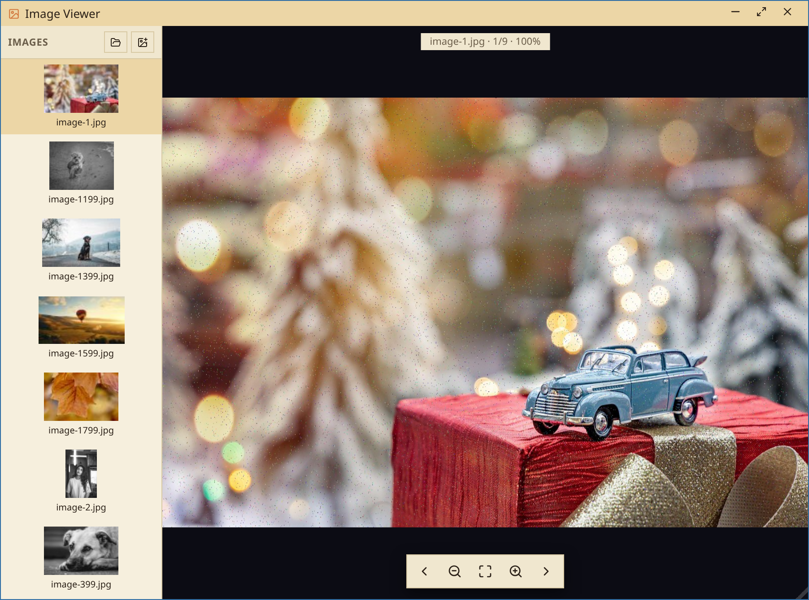
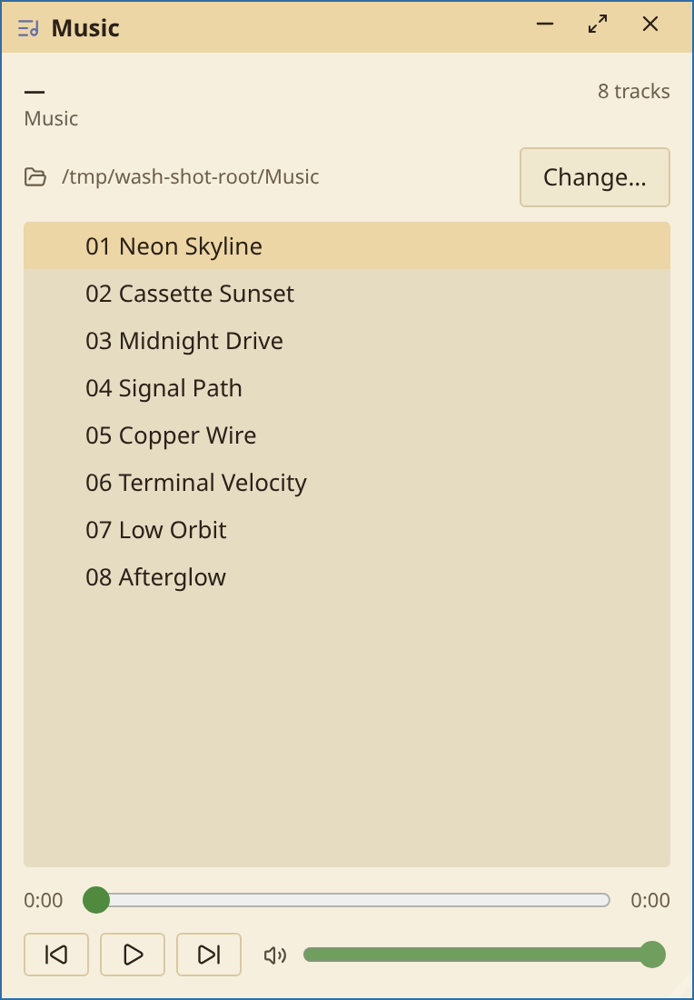
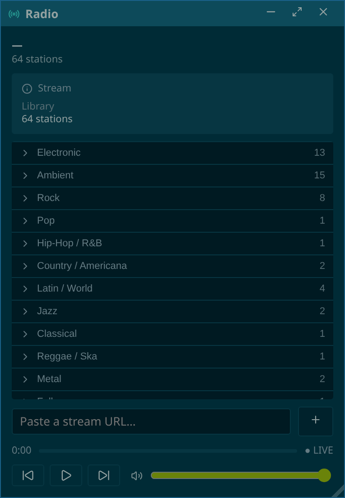
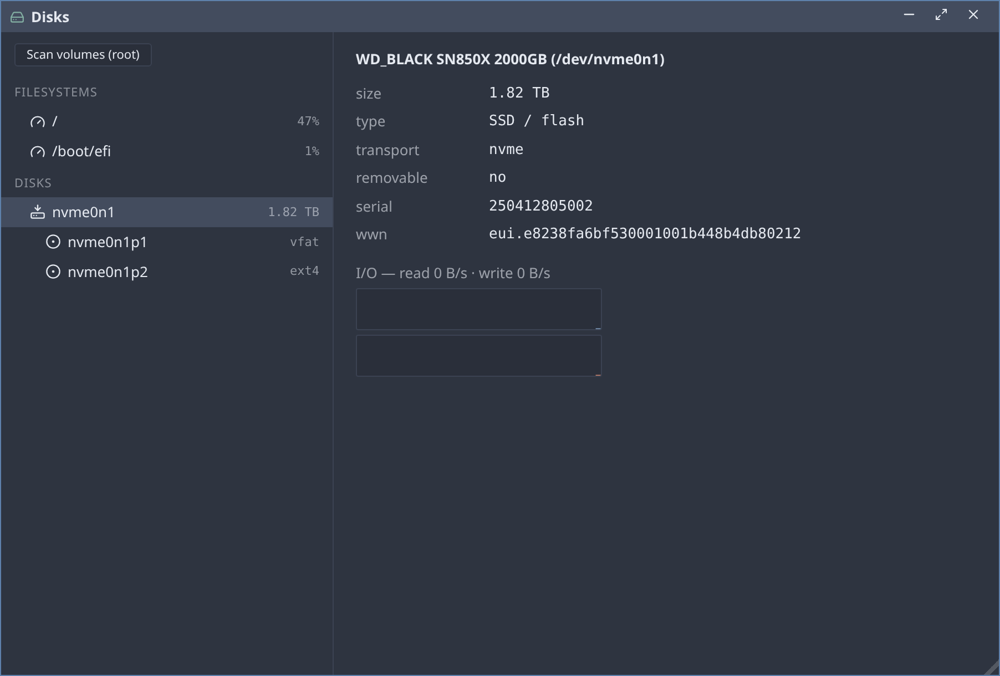
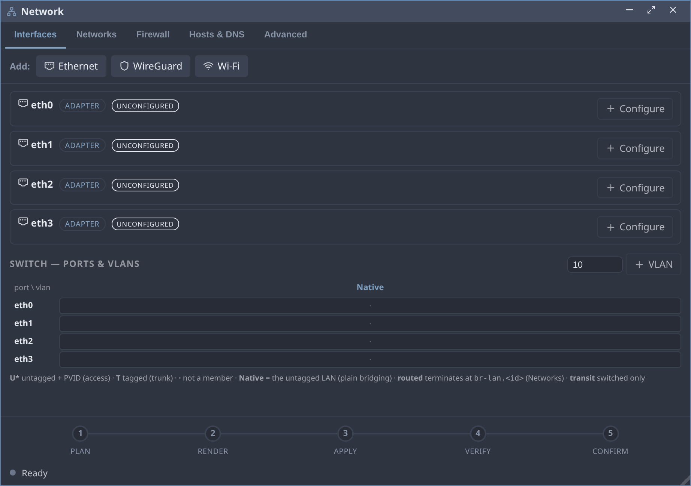
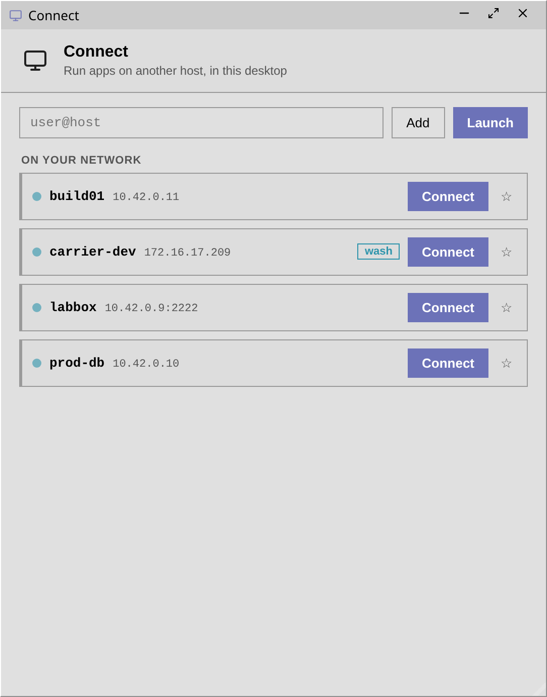
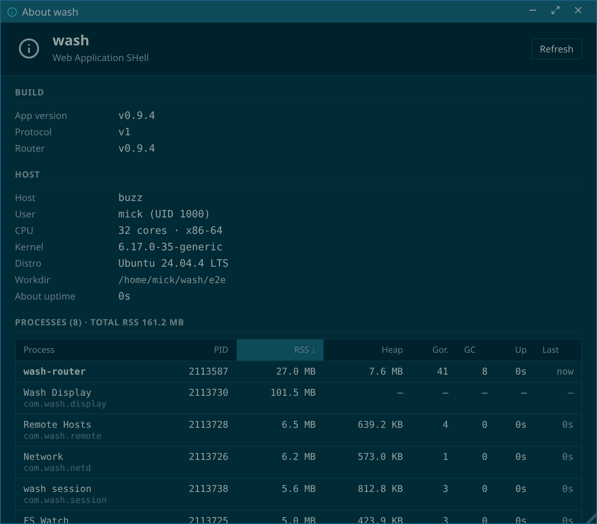
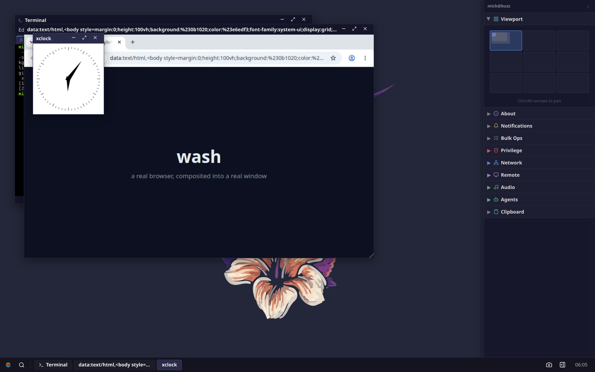

# wash — Web Application SHell

**A real Linux desktop, delivered to a browser tab over a single
WebSocket, from one static Go binary that runs anywhere — a laptop, a
home server, a Raspberry Pi, or a RISC-V emulator compiled to WASM.**

> 🖥️ **Try it now, no install:** **[sirmick.github.io/wash](https://sirmick.github.io/wash/)**
> — a full wash desktop running on *real* Linux (Linux 6.6 LTS riscv64
> + busybox userland) inside a WASM-compiled RISC-V emulator, booting
> in ~3 seconds. The whole thing is ~24 MiB of static assets served
> straight from GitHub Pages — no backend, no relay, no account.


wash is **not** pixel-streamed remote desktop (no VNC, no RDP, no video
codec). Every surface is HTML the desktop owns and renders locally;
only events and file bytes cross the wire. It is a traditional
floating-window environment — taskbar, launcher, real draggable
windows, a workspace pager, a system sidebar — where the window
manager runs *in the browser* and each application is an independent,
one-file program that a transport-only **router** supervises.

License: **AGPL-3.0**. Current version: **0.9.4**.

---

## Table of contents

- [Why wash](#why-wash)
- [Screenshots](#screenshots)
- [Quickstart](#quickstart)
- [Connecting](#connecting)
- [Remote apps](#remote-apps)
- [Apps](#apps)
- [CLI tools](#cli-tools)
- [Footprint — how little it uses](#footprint--how-little-it-uses)
- [Development loop](#development-loop)
- [Running the browser demo locally](#running-the-browser-demo-locally)
- [Packaging (deb / rpm / apk)](#packaging-deb--rpm--apk)
- [Router flags](#router-flags)
- [Trust & privilege model](#trust--privilege-model)
- [Architecture](#architecture)
- [Wire protocol](#wire-protocol)
- [Capabilities](#capabilities)
- [Filesystem](#filesystem)
- [Repository layout](#repository-layout)
- [Documentation](#documentation)
- [Testing](#testing)

---

## Why wash

A desktop environment is normally a heavy, machine-local stack. wash
turns it into a **single static binary plus a browser**:

- **One binary, zero dependencies.** `CGO_ENABLED=0`, statically
  linked, cross-compiles to amd64 / arm64 / riscv64 / mips. Drop it on
  a box and run it. It can even ship as a **multicall binary** — one
  `wash` executable with busybox-style `wash-<app>` symlinks, so the
  whole desktop is *one* file.
- **HTML, not pixels.** The browser renders the UI. The wire carries
  events and file bytes, not framebuffers — so it stays responsive
  over slow links and uses a fraction of the bandwidth of VNC/RDP.
- **Apps are isolated processes.** Each app is a Go backend
  event-loop with an embedded web-component bundle. The router
  supervises them, mux'es their channels, and **never interprets
  their payloads** — it's pure transport.
- **It's the real machine.** Backends run as your Unix user and
  syscall directly: the file manager calls `stat(2)`, the process
  monitor reads `/proc`, the package manager drives `apt`/`dnf`/`apk`,
  the service manager drives `systemd`/`openrc`/`procd`. No
  reimplemented userland.
- **Other machines, too.** Point the **Connect** app at `user@host`
  and that machine's apps composite into your desktop over plain SSH —
  one connection, no extra ports, each host colour-tinted. See
  [Remote apps](#remote-apps).
- **Tiny.** The router idles around **25 MB RSS**; a full desktop
  session — router plus a dozen app processes — sits near **100 MB
  RSS** total. The browser demo runs an *entire Linux system* in a
  64 MB emulated machine.

---

## Screenshots

| | |
|---|---|
| **Files** — tree + preview, live watch, mutations · *Midnight theme* | **Terminal** — tabbed xterm.js over real local PTYs · *Midnight theme* |
|  |  |
| **Editor** — CodeMirror 6, file tree, tabs, embedded terminal · *Tokyo theme* | **Image Viewer** — thumbnail list + zoom/pan, bytes over the wire · *Seoul theme* |
|  |  |
| **Washamp** — a Webamp (Winamp-skinned) audio player · *Midnight theme* | **Radio** — curated SomaFM + Radio Browser, ICY metadata · *Tokyo theme* |
|  |  |
| **System Monitor** — live `/proc` CPU/mem/net, per-process kill · *Oslo theme* | **Disks** — partitions, md/LVM/btrfs/ZFS, SMART · *Oslo theme* |
|  |  |
| **Services** — systemd/openrc/procd units, start/stop · *Seoul theme* | **Packages** — apt/dnf/apk search, install, upgrade · *Copland theme* |
|  |  |
| **Network** — interfaces, VLAN switch, firewall, plan→apply→verify · *Oslo theme* | **Settings** — wallpaper, clock, taskbar, theme packs · *Seoul theme* |
|  |  |
| **Connect** — SSH to another host + LAN mDNS "On your network" · *Copland theme* | **About** — build / router / host facts, live process table · *Tokyo theme* |
|  |  |

**Display** — real X11/Wayland clients (here Chromium and `xclock`)
launched from a wash terminal, composited into native wash windows by
the bundled `wash-display` compositor:



---

## Quickstart

Prerequisites: **Go ≥ 1.25** (see `go.mod`), **pnpm**, **make**, and
optionally **brotli** for smaller embedded bundles. Linux is the
target; macOS works for development but not every app (wash-priv, the
privilege primitive, expects Linux semantics).

```bash
git clone https://github.com/sirmick/wash.git
cd wash
make wash            # build the multicall layout directly into ./out/ (the shipped layout)
make run             # or: ./out/wash-router  — serves http://localhost:11000/
```

Open **`http://localhost:11000/`**. The session app boots
automatically; click the launcher (bottom-left) to open apps.

`make wash` builds one **multicall** binary (`out/wash`) with a `wash-<app>`
symlink per app beside it — exactly what the deb/rpm/apk packages ship, so dev
runs the same dispatch + probe paths as production. Prefer the per-app binaries
(one standalone ELF per app under `out/singlecall/`)? Build the **standalone**
layout:

```bash
make wash-standalone        # one ELF per app under ./out/singlecall/  (+ wash-display if wlroots is present)
./out/singlecall/wash-router   # serves http://localhost:11000/
```

Everything is a `make` verb: `make wash` (multicall) / `make wash-standalone` to build,
`make run` to launch the router, `make dev` for the Vite HMR loop,
`make unit-test` / `make e2e-test` / `make all-test`, `make all-clean`, and
`make <arch>-<platform>-<pkg>-package` for native packages. The full list is
in [COMMANDS.md](COMMANDS.md).

---

## Connecting

wash has two front ends, for two situations.

### Single-user (localhost / dev)

`wash-router` serves the shell and the WebSocket itself on
`0.0.0.0:11000`. Open `http://localhost:11000/`. There is **no
authentication** — anyone who can reach the socket gets the desktop —
so bind it to loopback and reach it over an SSH tunnel or Tailscale.
The router prints a warning if `--listen` isn't loopback. This is the
mode the Quickstart above starts.

### Multi-user (production)

`wash-login` is a small privileged front door that authenticates
browser users and gives each one isolated session(s):

```bash
# Behind a TLS terminator (nginx / Caddy / Tailscale-serve):
sudo setcap cap_setuid,cap_setgid,cap_kill+ep /usr/bin/wash-login   # or: make wash-login-deploy
wash-login --cookie-secure                                          # default :11000
```

1. The browser hits `/login`; wash-login authenticates against the
   **system's real login** by running `su -c true <user>` over a PTY —
   so PAM / LDAP / SSSD / Kerberos all work, and wash never
   reimplements crypto.
2. On success it mints an **HMAC-signed `wash_session` cookie**
   (HttpOnly, SameSite=Strict).
3. On `/ws` it finds or **spawns a per-user `wash-router`** running as
   that user's uid, then hands the raw socket to it via `SCM_RIGHTS`
   and steps out of the data path. The kernel enforces isolation
   between users.
4. Each user can run multiple named sessions; a picker appears when
   more than one exists. Sessions are discovered by walking `/proc`,
   so wash-login holds no per-session state and is restart-safe.

wash-login speaks plain HTTP — **always put TLS in front of it** (it
needs `CAP_SETUID`/`CAP_SETGID`/`CAP_KILL`, nothing more). Full
design, flags, and the `/run/wash/<uid>/sessions/` layout are in
[docs/MULTIUSER.md](docs/MULTIUSER.md).

---

## Remote apps

Run apps from **another machine** inside your wash desktop. Open the
**Connect** app, type an SSH target (`user@host`), and Connect — that
host's app windows composite into your desktop, each tinted with the
host's own colour so you always know which machine a window lives on.
A terminal from `build01`, a file manager from `db-prod`, and your
local editor share one desktop, one taskbar, one clipboard.

It's the multi-homed-shell model, **not** a federated router:

- **SSH is the only transport and the whole trust boundary.** The
  remote `wash-router` binds a loopback unix socket with no token; the
  only way to reach it is through your SSH session. No wash port faces
  the network on the remote host.
- **One port, one connection.** Your browser keeps its single
  connection to the local router. The remote host's wire is
  multiplexed over it as a `peer` channel that the local router splices
  **verbatim** to the `ssh -L`'d socket — it never parses the remote's
  frames (a relay, not a router-of-routers). Works over every
  transport: a plain WebSocket, the VM proxy, an in-browser VM.
- **The merge lives in the browser.** The shell is a client of two
  routers at once and merges their window/focus streams into one
  desktop, routing each intent back to the host that owns the window.
  Window ids are per-router, so identity is always `(host, window)`.
- **Apps don't know they're remote.** Any wash app runs unmodified on
  the far side; the machine-half (PTYs, file ops, spawn) is correctly
  host-local, and the presentation-half attaches at your seat.

Typical use:

```text
Connect → type  user@host  → Launch        # connect; the app dropdown opens
pick an app from the dropdown                # it composites in, host-tinted
★ to bookmark the host for next time         # passphrased key? an ssh-add unlock appears
```

**On your network.** Connect also discovers other wash hosts on the LAN
over **mDNS** and lists them under *"On your network"* — click one to
connect without typing an address. (See
[docs/DISCOVERY.md](docs/DISCOVERY.md).)

**Mount a remote filesystem.** Beyond running apps, you can mount
another host's filesystem locally over **SFTP** (FUSE), so local apps
see the remote tree as ordinary paths. (See [docs/MOUNT.md](docs/MOUNT.md).)

Connected hosts — plus their live sessions and mounts — show in the
desktop's right-hand **Remote** sidebar widget and in **Settings →
Remote**, each with its own launch dropdown and a graceful teardown.
Full design — the service split, the per-host security model, and the
wire relay — is in [docs/REMOTE.md](docs/REMOTE.md).

---

## Apps

Each app lives in `apps/<name>/`: the Go backend under `be/`, the web
component bundle under `fe/`. The Makefile builds the FE bundle and
**embeds it into the BE binary**, so an app is genuinely one file. The
session app autoboots when a browser connects; the rest are launched
by the user (launcher menu, `wash-launch`) or by other apps holding
the `spawn` capability.

A **surface** declares how an app presents: `window` (a normal
window), `desktop` (the chrome itself), or `background` (a headless
service, no window).

The chrome:

| App | ID | Surface | What it does |
|---|---|---|---|
| **session** | `com.wash.session` | desktop | The desktop chrome — taskbar, launcher, wallpaper, workspace pager, system banner, and the right-hand sidebar widget host. Autoboots on connect. Watches `~/.config/wash/desktop.json` and live-reloads. Acts as the gateway that subscribes to the background services and feeds their state to the sidebar widgets. |

Windowed apps (open from the launcher):

| App | ID | Surface | What it does |
|---|---|---|---|
| **fm** — Files | `com.wash.fm` | window | File manager — tree + preview, plus a thumbnail **folder-grid** for image folders. List, read, write, rename, delete, chmod/chown, symlink, live `fswatch`. Per-extension icons and display hints (executable / read-only / broken-link colours, setuid badge, mount-point & device icons). Double-click opens a file in its registered app (images → Image Viewer, text/code → Editor) or falls back to the preview pane. Upload from the OS (picker + external drag-drop, recursive dirs). Cut/copy/paste + drag-drop move synced across windows via the router clipboard (cross-host moves are rejected for now). Sandboxable with `--fs-root`. |
| **term** — Terminal | `com.wash.term` | window | Terminal emulator — tabbed xterm.js over local PTYs (`internal/pty`). `--exec ARGS` runs a one-shot command; `--login` starts a login shell (used by the Root Terminal). |
| **edit** — Editor | `com.wash.edit` | window | Text editor — CodeMirror 6 with a sidebar tree, tabs, an embedded terminal pane, and a file picker. Reloads on external change. "Open in fm" spawns the file manager (uses `spawn`). Registered to open text/code files (`--open`). |
| **imageview** — Image Viewer | `com.wash.imageview` | window | Image viewer — a thumbnail list + zoom/pan view (wheel-zoom, drag-pan, fit, arrow-key prev/next). An Open dialog picks a folder or a single image. Bytes + thumbnails stream over the wire's raw channels (no HTTP), so it works in the in-browser VM too. Registered to open image files (`--open`); thumbnails come from `internal/thumbs` (zero-dep decode + cached downscale). |
| **top** — System Monitor | `com.wash.top` | window | System monitor — reads `/proc` directly, no daemon. Live CPU / memory / network / disk, per-process detail, and signal/kill. Pauses its stream while minimized. |
| **services** | `com.wash.services` | window | Init-system manager — detects systemd / openrc / procd, lists units, and runs start/stop/restart/enable/disable through wash-priv. Deep-links into the matching log viewer for a unit. |
| **journal** | `com.wash.journal` | window | systemd-journald viewer — streams parsed `journalctl` JSON with unit / priority / time filters. Tries unprivileged first; offers "Read with root" via wash-priv on permission denied. |
| **syslogs** — System Logs | `com.wash.syslogs` | window | Classic `/var/log/*.log` viewer — `tail -F` one file at a time. The non-systemd sibling of journal; same privilege-escalation fallback. |
| **packages** | `com.wash.packages` | window | Package-manager front-end — auto-detects apt / dnf / apk. Search, install, remove, upgrade; mutations stream into an embedded terminal through wash-priv. |
| **net** — Network | `com.wash.net` | window | Networking — interfaces, networks/VLANs, firewall, hosts & DNS, routing, Wi-Fi. A UCI-shaped model rendered to **NetworkManager / systemd-networkd / UCI** backends by capability, with a plan → render → apply → verify → confirm flow and automatic rollback. Drives the `netd` daemon. |
| **disks** — Disks | `com.wash.disks` | window | Storage manager — disks, partitions, md-RAID, LVM, btrfs, ZFS, and SMART health. Privileged operations go through wash-priv. |
| **washamp** — Washamp | `com.wash.washamp` | window | Audio player — a chromeless [Webamp](https://webamp.org) (Winamp 2.x) player with the classic skins, playlist, and a skin switcher. Reports now-playing/transport to the `audio` service for the sidebar widget. |
| **music** — Music | `com.wash.music` | window | Minimalist native music player — point it at one folder, get a recursive track list with tags. The lightweight counterpart to Washamp. |
| **radio** — Radio | `com.wash.radio` | window | Internet radio — curated SomaFM + Radio Browser "popular" + paste-a-URL. The BE proxies the stream and surfaces ICY now-playing metadata. |
| **vscode** — VS Code | `com.wash.vscode` | window | Full VS Code (code-server) embedded in a wash window via the per-instance HTTP/WS **ingress** proxy. Backed by the `vscode` service (below). |
| **connect** — Remote | `com.wash.connect` | window | Connect to another host over SSH and run **its** apps in this desktop — their windows composite in, tinted with the host's colour, over your single existing connection (no extra ports opened). Per-host app-launch dropdown, bookmarks, and an `ssh-add` unlock flow for passphrased keys. Fronts the `remote` supervisor (below). See [Remote apps](#remote-apps). |
| **settings** | `com.wash.settings` | window | Desktop preferences — wallpaper, clock format, taskbar position. Writes `~/.config/wash/desktop.json` atomically; session fswatches and reloads. |
| **about** — About wash | `com.wash.about` | window | Build / router / host facts plus a live Go-runtime process table polled from the router. The launch-flow smoke test. |
| **test** | `com.wash.test` | window | E2E target — hidden from the catalog unless `--show-hidden`. Drives the Playwright suite. Built with `make test-app`. |

Background services (no window — they feed sidebar widgets and back the apps above):

| App | ID | Surface | What it does |
|---|---|---|---|
| **bulk** — Bulk Ops | `com.wash.bulk` | background | Singleton job queue + worker for recursive delete / move / copy. fm enqueues jobs; conflicts block until the user resolves them in the sidebar widget. |
| **notify** — Notifications | `com.wash.notify` | background | Notification service — any app posts notifications; notify keeps capped history and feeds the sidebar widget; the router also fans them out as transient toasts. |
| **priv** — Privileged Actions | `com.wash.priv` | background | The single privilege primitive. Other apps ask priv to run / spawn a registered binary as root; the user approves in a queue UI; the sudo password lives only in BE memory with an idle timeout. Windows backed by root wear a red **ROOT** stripe. |
| **netd** | `com.wash.netd` | background | The privileged networking backend — validates and applies the net app's plan through NM / networkd / UCI. Reserved-id singleton; the net app relays to it cross-app. |
| **audio** | `com.wash.audio` | background | Audio control-plane — aggregates now-playing/transport state from Washamp / Music / Radio and feeds the sidebar Audio widget. |
| **vscode** (service) | `com.wash.vscode` | background | Manages the code-server process + the ingress route that the VS Code window connects through. |
| **remote** | `com.wash.remote` | background | Remote-host supervisor — opens and superintends the SSH connections wash-connect drives, reports per-host status (incl. auth-needed), and registers the multiplexed "peer" wire the shell splices to each host. See [Remote apps](#remote-apps). |

Not an app but supervised the same way: **wash-display**, a native C++
Wayland compositor (vendored wlroots). The router starts it on demand;
X11/Wayland clients launched from a wash terminal map as
`wash-app-display` windows (see the Display screenshot above).

**Cross-app wiring:** services → journal/syslogs (log deep-links);
packages / services / journal / syslogs → priv (privileged actions);
fm → bulk (file jobs); net → netd (apply); Washamp / Music / Radio →
audio (now-playing); connect → remote (SSH supervision); session →
notify / bulk / priv / audio / net / remote (sidebar widgets). All of
it travels as router-attested `app_msg` —
apps never hold references to each other, only the router does.

## CLI tools

These are CLIs (no FE, no window) but they're how you drive a running
wash from a shell. Both land in `out/` after a normal `make`.

| Tool | What it does |
|---|---|
| **wash-launch** | `wash-launch <app-id>` spawns an app from the terminal. `wash-launch msg <instance> <json>` relays an `app_msg`, optionally awaiting a reply. Finds the router via `WASH_CONTROL_SOCKET`. |
| **wash-sudo** | A sudo-shaped CLI for wash-priv: `wash-sudo cmd args…`. Approval + password happen in the browser, never in the terminal. `--window` opens a root wash-term; `--app <id>` spawns a registered app as root. |
| **wash-login** | The multi-user front door (see [Connecting](#connecting)) — browser auth, per-user session routers. |

---

## Footprint — how little it uses

wash is built to run on the kind of hardware where a conventional
desktop won't fit.

| Thing | Cost |
|---|---|
| Idle router (no shell connected) | **~25 MB RSS** |
| A single app backend process | ~7–10 MB RSS |
| Full desktop session (router + ~12 app processes) | **~100 MB RSS** total |
| Router binary on disk (amd64, static, `-s -w`) | ~7.5 MB |
| Multicall `wash` binary in the demo VM (riscv64) | **~11 MB** — *all* apps + router + login |
| Whole browser demo (kernel + rootfs + emulator + UI) | **~24 MiB** static assets |
| Emulated machine the demo's full Linux system runs in | 64 MB RAM |

The wire carries events and file bytes, not video — bandwidth scales
with what you actually do, not with screen size or frame rate.

---

## Development loop

```bash
make dev        # vite at :5173 (HMR), router at :11000, /ws proxied
```

Open `http://localhost:5173/`. Edits under `web/shell/src/`
hot-reload. Edits to Go sources or app FE bundles need a rebuild — or
run the router in watch mode:

```bash
./out/wash-router --dev
```

`--dev` watches the app binaries. Rebuild an app (`make out/wash-fm`, say)
and the router kills running instances and pushes a `shell.reload` so
the new bundle takes over live. Rebuilding the router itself triggers
a self-re-exec.

---

## Running the browser demo locally

The thing hosted at [sirmick.github.io/wash](https://sirmick.github.io/wash/)
lives in [`wash-vm/`](wash-vm/): wash running inside a **real** Linux
VM (upstream Linux 6.6 LTS riscv64 + OpenSBI + a buildroot/musl
rootfs) on **TinyEMU compiled to WASM**, talking to the browser over a
multiport virtio-console. Everything builds in Docker — no host
cross-toolchain required.

One shot: **`make browser-run-vm`** builds the artifacts and serves the
demo on <http://localhost:12000> (login `wash` / `wash`). The steps
below show the individual pieces:

```bash
# 1. Build the VM artifacts (kernel + firmware + rootfs + wasm). Docker only.
make -C wash-vm/image all      # ~5–10 min cold; cached after

# 2. Build the browser shell bundle.
pnpm -F @wash/shell build

# 3. Start the demo dev server (Vite + a /ws bus).
cd wash-vm/web && node server/server.mjs    # http://localhost:5180
```

Open `http://localhost:5180`. To deploy it statically (GitHub Pages,
S3, Cloudflare), `vite build --base=/your-path/` the host page and
ship `wash-vm/web/dist/` — the recipe and the static-hosting caveats
are in [`wash-vm/README.md`](wash-vm/README.md). CI rebuilds and
publishes it on every push to `main`
([`.github/workflows/demo.yml`](.github/workflows/demo.yml)), pulling
prebuilt kernel/firmware/wasm blobs from a rolling release so the
build stays fast.

---

## Packaging (deb / rpm / apk)

### Install the latest release

Every tagged release ships native packages for all four distros.
These URLs always resolve to the latest:

A real native install your OS verifies and tracks — **no `curl … | sh`**.
Only `dnf` installs straight from a URL; `apt` and `apk` want the file local first:

```bash
# Ubuntu 24.04
curl -fLO https://github.com/sirmick/wash/releases/latest/download/wash-ubuntu-24.04-amd64.deb
sudo apt install -y ./wash-ubuntu-24.04-amd64.deb

# Debian 13
curl -fLO https://github.com/sirmick/wash/releases/latest/download/wash-debian-13-amd64.deb
sudo apt install -y ./wash-debian-13-amd64.deb

# Fedora 40 — installs from the URL directly
sudo dnf install -y https://github.com/sirmick/wash/releases/latest/download/wash-fedora-40-amd64.rpm

# Alpine 3.21 (apk wants a local file, like apt)
wget https://github.com/sirmick/wash/releases/latest/download/wash-alpine-3.21-amd64.apk
sudo apk add --allow-untrusted ./wash-alpine-3.21-amd64.apk
```

These are **stable filenames** (no version) that always resolve to the
newest release — the page at
<https://github.com/sirmick/wash/releases/latest> has the same files if you'd
rather click. **amd64 only** for now (CI builds amd64); arm64/riscv64 and
OpenWRT build from source (below). Once installed, start a single-user
session with `wash-router` and open <http://localhost:11000/>.

### Build from source

```bash
./packaging/run_matrix.sh                       # all rows → dist/packages/<tag>/
WASH_PKG_VERSION=0.9.4 ./packaging/run_matrix.sh # pin the version
```

Each row does a two-stage Docker build: it builds the package
(`dpkg-buildpackage` / `rpmbuild` / `abuild`) from a source tarball,
then installs it into a *fresh* image and runs smoke tests, the
distro-integration tests, and a boot check. Packaging sources live in
`debian/`, `rpm/wash.spec`, and `alpine/APKBUILD`; the package installs
the `wash-*` binaries into `/usr/bin` and creates the `wash` group +
`wash-system` user for the multi-user front door. CI runs the same
matrix and attaches the artifacts to tagged releases
([`.github/workflows/matrix.yml`](.github/workflows/matrix.yml)). The
distro backends and install layout are documented in
[docs/MATRIX.md](docs/MATRIX.md).

---

## Router flags

```
--listen HOST:PORT          # default 0.0.0.0:11000
--apps-dir DIR[:DIR…]       # default: dir of the wash-router binary
--no-session                # don't autoboot wash-session
--initial-app APP_ID        # spawn this app full-screen ("kiosk")
--fs-root PATH              # sandbox every fs-touching app under PATH
--show-hidden               # include manifest.hidden apps in the catalog
--control-socket PATH       # default /tmp/wash-<uid>.sock (or "none")
--screenshot-dir DIR        # default /tmp/wash-screenshots (or "none")
--dev                       # watch binaries; auto-reload on rebuild
--listen-unix PATH          # ctl socket for SCM_RIGHTS handoff (multi-user)
--name NAME                 # human-readable session name (multi-user)
--idle-timeout DUR          # self-exit when idle (default 30m under --listen-unix)
--version
```

---

## Trust & privilege model

> **Read this before binding to anything other than localhost.**

The bare `wash-router` is single-principal: the router and the apps it
spawns all run as one trusted Unix user, on a localhost-trust
boundary. There is **no authentication beyond "you can reach the
socket."** Bind to `127.0.0.1` and expose via SSH tunnel or Tailscale;
the router warns when `--listen` isn't loopback. For real multi-user
access, front it with [`wash-login`](#multi-user-production), which
gives each browser user a session router under their own uid.

The **browser side has no ambient authority** — every action funnels
through a router or app process; the FE can't touch the filesystem or
spawn anything on its own. **wash-priv** is the single place a sudo
password may live (BE memory only, idle timeout, cleared on refresh),
and every window whose backing process runs as root — or is wash-priv
itself — wears a red **ROOT** stripe so privilege is always visible.

---

## Architecture

Three ideas carry the whole design (full rationale and the locked
decisions are in [docs/ARCHITECTURE.md](docs/ARCHITECTURE.md)):

**1. The router is a transport, not a kernel.** It muxes channels
between processes, enforces flow control, and relays frames verbatim.
It **never parses an app's payloads** — all domain semantics live in
the app's BE and the browser shell. That's why the router stays tiny
and apps can't be coupled through it.

**2. The desktop is itself an app.** `wash-session` (surface =
`desktop`) draws the taskbar, launcher, wallpaper, pager, and sidebar.
The **window manager runs in the browser** but state is
server-authoritative: the router owns geometry, z-order, and focus,
and every shell observes it via a `session.snapshot` on connect plus
`session.patch` deltas. Reconnect a tab and the desktop is exactly as
you left it.

**3. Apps are one-file processes.** A Go event-loop backend with an
embedded web-component bundle. The **backend is the only thing with
syscalls**; the frontend has zero OS authority. The app's FE↔BE link
is the one place its own semantics live. Apps present on one of three
surfaces — `window`, `desktop`, `background` — and declare
[capabilities](#capabilities) the router enforces.

```
        browser tab                         host process tree
  ┌───────────────────────┐         ┌──────────────────────────────┐
  │  shell runtime (WM)    │         │  wash-router  (transport)     │
  │   ├ wash-session FE    │◀──WS──▶ │   ├ mux channels / QoS        │
  │   ├ wash-fm FE         │  frames │   ├ server-authoritative WM   │
  │   ├ wash-term FE       │         │   ├ control socket            │
  │   └ …                  │         │   └ serves shell + bundles    │
  └───────────────────────┘         │        │ unix-socket frames    │
                                     │   ┌────┴─────────────────┐    │
                                     │   ▼      ▼       ▼        ▼    │
                                     │ session  fm   term  …  priv   │  ← Go BE
                                     │ (each syscalls as the user)   │
                                     └──────────────────────────────┘
```

A deeper code map — what lives where, the SDK callbacks, the
channel-binding registry, bundle delivery, the control socket — is in
[docs/INTERNALS.md](docs/INTERNALS.md).

### The SDK

App authors get `internal/sdk`: `sdk.Main(&sdk.AppDef{…})` does the
manifest probe, handshake, and event loop; callbacks
(`OnReady`, `OnMapped`, `OnAppMsg`, `OnCloseRequested`, …) deliver
window and message events. On top sit a typed message **bus** (request
/ ok / err by `kind`, plus cross-app `Call`), a **StateService**
(subscribe-with-snapshot, used by bulk / notify / priv), and
`EnableFilePicker` (wires the shared `<FilePicker>` to the host BE's
own `fs.*` handlers).

## Wire protocol

Two transports, one frame format: **WebSocket** (browser ↔ router) and
a **Unix socket** (app ↔ router). A frame is a fixed 8-byte big-endian
header + payload:

```
┌────────┬──────────────────┬──────────────┬───────────────┐
│ flags  │   channel-id      │   length     │   payload     │
│  1 B   │     3 B (24-bit)   │  4 B (32-bit) │  ≤ 16 MiB     │
└────────┴──────────────────┴──────────────┴───────────────┘
   flags: bit0 = END (message boundary) · bits1–2 = QoS class
```

Channels carry different disciplines:

- **Channel 0 — control** (JSON): `identity` handshake, channel
  open/close, errors.
- **Channel 1 — event** (JSON): window events, `app_msg`, `spawn`,
  clipboard, `app_state`.
- **Channels 2+ — raw** (opaque bytes): PTY streams, file content,
  app-owned byte streams.

**Handshake:** the app sends `{"t":"identity","app_id":…,"proto":1}`
on channel 0; the router replies `identity.ack` with an
`instance_id`, `window_id`, and a `session` bag (e.g. the `--fs-root`
sandbox). **Cross-app messaging** rides `app_msg` with a
**router-attested** `from` field — the only way apps talk, and they
can't forge a sender.

**QoS:** the two class bits split frames into **Interactive**
(keystrokes, pointer, focus — drained first) and **Bulk** (PTY
output, file replies, log lines). The router runs strict-priority
per-class queues plus FE→router **credit windows**, so a
`cat 100MB` in one terminal can't head-of-line-block keystrokes in
another. Full spec in [docs/WIRE.md](docs/WIRE.md); QoS detail in
[docs/QOS.md](docs/QOS.md).

## Capabilities

Apps declare capabilities in their manifest; the router enforces them:

- **`spawn`** — may call `SpawnRequest(app_id)` to launch other apps.
  Held by `session`, `edit`, `services`. The router refuses spawn
  requests from apps that don't declare it.
- **`prepare_spawn`** — may call `PrepareSpawn(app_id)` to have the
  router mint a pending-attach record (instance_id + token) for a
  child the app forks itself (e.g. wash-priv wrapping a binary in
  sudo). Held by `priv`.

Reserved app ids (currently just `com.wash.priv`) are served **only**
from a uid-0-owned binary or one under a declared trusted dir
(`--dev` trusts the apps dir; `WASH_TRUSTED_APPS_DIRS` declares
specific paths).

## Filesystem

Apps that touch the filesystem (fm, edit, settings, bulk) run as the
user and **syscall directly** — there is no router-side fs service.
`internal/fs` provides the read accessor and a sandboxed `Confine`;
`internal/fswatch` wraps fsnotify with refcounted per-path
subscriptions. The router ships the `--fs-root` sandbox in the
handshake `Session` bag; apps that honor it `Confine` every
path-taking operation. With no root, apps are unconfined.
`@wash/ui`'s `<FilePicker>` works in any app whose BE calls
`sdk.EnableFilePicker(c)`.

## Repository layout

```
cmd/                wash (multicall), wash-router, wash-login,
                    wash-launch, wash-sudo, wash-priv-fakesudo
apps/<name>/be,fe   each app: Go backend + embedded web-component bundle
internal/
  wire/             frame codec, transports, message types
  router/           router + WM state + control socket + HTTP
  runner/           per-binary entrypoints (router, login, launch)
  login/            multi-user auth, /proc session registry, picker
  sdk/              app SDK (handshake, dispatch, bus, state, filepicker)
  fs/  fswatch/     read accessor + sandbox; refcounted fsnotify
  bulkops/          queue + worker for wash-bulk
  pty/  proc/       PTY sessions; /proc readers for top
  loopback/         in-memory transport for end-to-end tests
web/
  shell/            browser shell runtime (WM, WS client)
  lib/              @wash/ui — shared web components + FilePicker
wash-vm/            the in-browser RISC-V Linux demo (kernel/rootfs/wasm/host)
wash-display/       native X/Wayland compositor (C++/CMake, optional) — see its README
packaging/ debian/ rpm/ alpine/    distro package builds
e2e/                Playwright suite
docs/               see below
```

## Documentation

| Doc | Covers |
|---|---|
| [ARCHITECTURE.md](docs/ARCHITECTURE.md) | Intent, constraints, the locked design decisions. |
| [WIRE.md](docs/WIRE.md) | The wash wire protocol — framing, channel disciplines, message vocabulary. |
| [QOS.md](docs/QOS.md) | Priority classes, the strict-priority scheduler, credit windows. |
| [INTERNALS.md](docs/INTERNALS.md) | Code map: what lives where, how the pieces fit, what the SDK gives you. |
| [MULTIUSER.md](docs/MULTIUSER.md) | wash-login: browser auth, per-user routers, SCM_RIGHTS handoff, sessions. |
| [MATRIX.md](docs/MATRIX.md) | Distro packaging — apt/dnf/apk backends, the package matrix, install layout. |
| [DISPLAY.md](docs/DISPLAY.md) | The native X/Wayland compositor (`wash-display`): build reality, capture pipeline, wire client. |
| [NET.md](docs/NET.md) | Networking app + privileged daemon (`wash-net`/`wash-netd`): UCI-shaped model, backends. |
| [REMOTE.md](docs/REMOTE.md) | Remote apps over SSH — the multi-homed shell, the one-port wire relay, the per-host security model. |
| [DISCOVERY.md](docs/DISCOVERY.md) | LAN mDNS auto-discovery ("On your network") for Connect, and the Settings Remote panel. |
| [MOUNT.md](docs/MOUNT.md) | Mounting another host's filesystem over SFTP (FUSE), surfaced through the Remote panel. |
| [STORAGE.md](docs/STORAGE.md) | The Disks app — block devices, md/LVM/btrfs/ZFS, SMART, the real-kernel VM gate. |
| [AUDIO.md](docs/AUDIO.md) | The audio control-plane service that aggregates now-playing for the sidebar widget. |
| [MUSIC.md](docs/MUSIC.md) / [RADIO.md](docs/RADIO.md) | The native Music player and the internet Radio app. |
| [IMAGES.md](docs/IMAGES.md) | The image pipeline — thumbnails over wire raw channels, fm folder preview, the viewer. |
| [TESTING.md](docs/TESTING.md) | Test tiers, the `make` test verbs, holistic coverage, VM-backed e2e, CI, gotchas. |
| [SCREENSHOTS.md](docs/SCREENSHOTS.md) | How the marketing shots are generated/themed, and the fs-root sandbox gotcha. |
| [TECH_DEBT.md](docs/TECH_DEBT.md) / [CORE_AUDIT.md](docs/CORE_AUDIT.md) | Known debt and the core audit / next tranche of work. |

## Building & testing each part

wash covers a lot of ground; each part builds and tests on its own. The
`make` verbs (`make wash`, `make unit-test`, `make e2e-test`, …) drive the
common flows, but you can also drive any single subsystem directly:

| Part | Build | Test | Prereqs |
|---|---|---|---|
| **Go core + apps** | `make wash` (→ `out/`) / `make wash-standalone` (→ `out/singlecall/`) | `go test ./...`, or one package: `go test ./apps/fm/...` | Go ≥ 1.25 |
| **Frontend logic units** | — | `node --test --conditions=browser <files>` (run by `make unit-test`; the `browser` condition makes Solid resolve its reactive build) | pnpm, Node ≥ 22 |
| **Frontend components** | — | `pnpm exec vitest run` (scopes `*.ctest.tsx` via `vitest.config.ts`) | pnpm |
| **End-to-end** | `make test-app` (builds the world + test app) | `make e2e-test` *or* `pnpm -C e2e exec playwright test` | Chromium (auto-downloaded first run); free inotify instances (`e2e/global-setup.ts` pre-flights this) |
| **VM-backed e2e** (net, real microvm) | `make net-test` — builds the openwrt + distro + Alpine images, then runs the gates | `net-vm-gate` / `net-vm-multi` drive the wash UI served over the wire by a booted VM; they self-skip until the artifacts + host are ready | `/dev/kvm` + `qemu-system-x86_64` + Docker |
| **Distro packages** | `make all-package` (or one leaf: `make amd64-ubuntu24-wash-package`) | runs inside the same matrix (smoke + boot + distro-integration) | Docker |
| **wash-display** (native compositor) | `make wash-standalone` (auto when wlroots present) / `WASH_DISPLAY=1 make wash-standalone` | local smoke harness only (not in CI) — see [`wash-display/README.md`](wash-display/README.md) | CMake + system wlroots/wayland `-dev` libs |
| **wash-vm** (in-browser RISC-V VM) | `make -C wash-vm/image all` | `wash-vm/test/*.mjs` (ad-hoc repro scripts) | Docker only |

`make unit-test` runs `go vet` + `go test` + the FE unit tiers; `make
e2e-test` the Playwright suite (standalone layout). `make all-test` is the
whole pyramid — unit + `multicall-smoke` + e2e + the kvm `net-test` /
`disks-test` gates (the VM tiers boot the **multicall** layout in-VM, so
that argv[0]-dispatch surface is covered without re-running the whole e2e
suite twice); `make net-test` and `make disks-test` run those gates alone;
`make all-package` the packaging matrix. `make coverage` produces the
merged go-unit + e2e report under `coverage/`. (`make verify` stays a quick
go-only gate: vet + test + static-ELF.) `make screenshots` regenerates the
`docs/screenshots/` shots.

**See [docs/TESTING.md](docs/TESTING.md)** for the full picture: what each
tier proves, the `make` test verbs, holistic coverage (`make coverage` →
merged go-unit + e2e, ~71%) and its gaps, the VM-backed e2e, what CI runs,
and the test-tier gotchas.

> **Note:** a fresh `git clone` builds the Go core, frontends, and wash-vm
> with no surprises. The native **wash-display** compositor is opt-in and
> needs system development libraries — see its README for the `apt install`
> line. Nothing in the build depends on the gitignored `tmp/` or `branches/`
> working dirs.

---

*wash is AGPL-3.0. The name stands for **W**eb **A**pplication
**SH**ell.*
