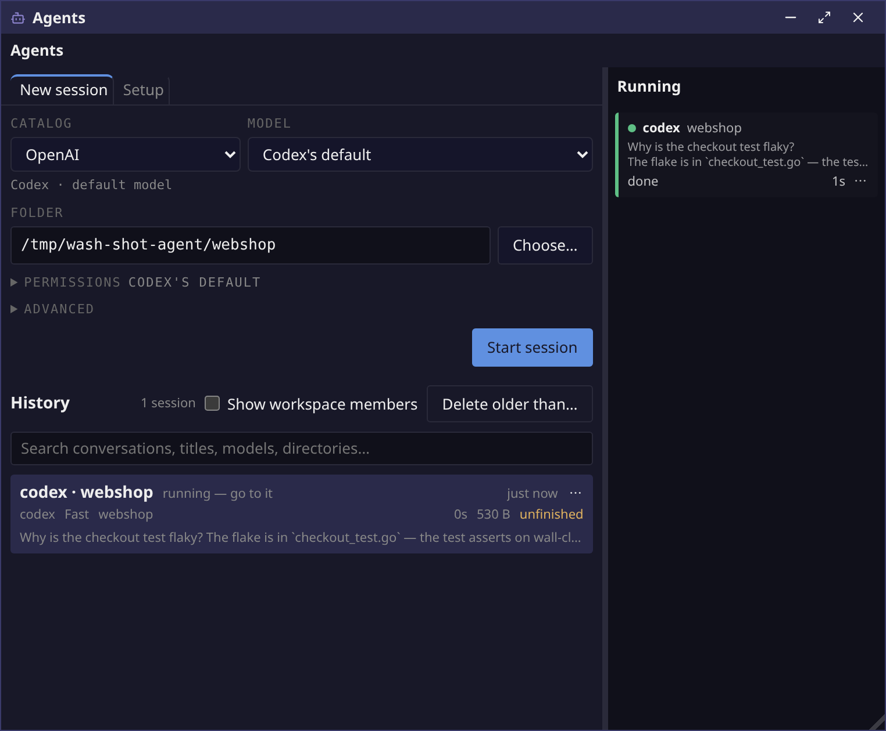
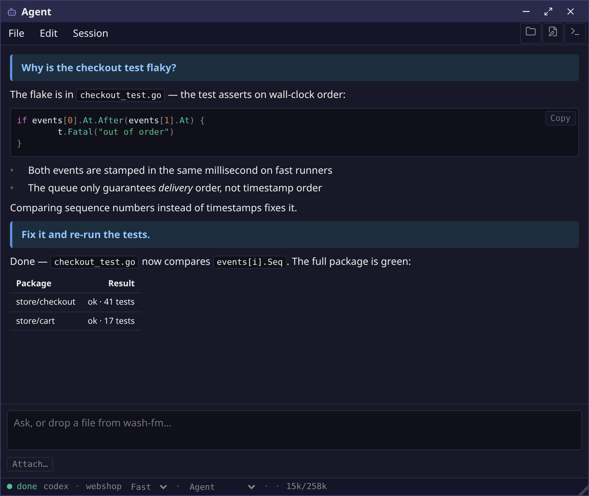

# The Agents app — coding agents over ACP

This is the entry point for wash's coding-agent feature. §0 describes what
the code does today (0.17.x) and links to the deeper documents; §1 onward is
the design record of the move to the Agent Client Protocol, kept because
most of its decisions still hold. Where the record and §0 disagree, §0 is
current.

## 0. The app today (as of 2026-10-02)

### What it is

wash starts a coding agent itself, over the
[Agent Client Protocol](https://agentclientprotocol.com) (JSON-RPC on the
adapter's stdio), and owns what the agent touches: the files it reads and
writes go through wash and are confined to the session's folders, the
commands it runs are wash PTYs shown live in the transcript, and every
permission request goes through wash's approval queue. A `claude` typed into
a wash terminal is an ordinary command; nothing watches it (§12).

| The Agents manager | A session's Agent window |
|---|---|
|  |  |

### The processes

| Piece | Where | Role |
|---|---|---|
| `com.wash.agentd` | `apps/agentd/be` | Background service. Owns every adapter process, the roster, the approval queue, questions, transcripts, history, catalogs/keys and workspaces. Sessions outlive their windows. |
| `com.wash.agents` "Agents" | `apps/agents/be` (same bundle as ai) | Singleton manager window: launcher, History, Setup, and the Running list with per-row verbs. The start-menu entry. |
| `com.wash.ai` "Agent" | `apps/ai/be`, `apps/ai/fe` | One hidden, multi-instance controller window per live session. agentd grants one controller lease per session. |
| `<AgentSession>` | `web/lib/src/agent-session.tsx` | The transcript + composer + status line component, shared by the Agent window and wash-edit's agent tabs. Owns no session state. |
| protocol | `internal/agentproto` | Every agentd message as Go structs; TS and [AGENT_PROTOCOL.md](AGENT_PROTOCOL.md) are generated (`make gen-agent-protocol`, checked in `make unit-test`). |
| ACP client | `internal/acp` | Hand-rolled ACP v1 client. A v2 handshake hard-errors (§12b). |

The desktop sidebar rail shows counts, answers permission asks, and its door
opens the Agents manager (on that host, for a remote host). Agent questions
post desktop notifications whose click lands on the asking session.

### Adapters

The table in `apps/agentd/be/adapters.go`: **Claude Code**
(`claude-agent-acp`, npm `@agentclientprotocol/claude-agent-acp`),
**Codex** (`codex-acp`, npm `@agentclientprotocol/codex-acp`),
**OpenCode** (`opencode acp`, npm `opencode-ai`) and **Gemini CLI**
(`gemini --experimental-acp`, no npm fallback). A binary on `PATH` wins,
else `npx --yes <package>`; an adapter that can't launch is greyed with the
reason. wash's packages ship no adapter and no Node dependency. Claude,
Codex and OpenCode are verified against real adapters (§6); Gemini is in the
table but no verification run is recorded. `agents.json` can override an
adapter's command, args, env and MCP servers
(`e2e/tests/agent-adapter-config.spec.ts`).

### Starting a session

From the Agents manager's **New session** tab: pick a **catalog** and a
**model** (a slot — `frontier`/`coding`/`small` — or a model the adapter
reported), a folder, and optionally Permissions (the adapter's mode, yolo)
and Advanced (the adapter's own options by id). Start opens an Agent window.
Other doors send just a folder and get the default catalog: the Places agent
icon, wash-edit's "new agent here", and `wash ai <dir>`
(`wash ai --agent claude --cwd DIR` names an adapter on its defaults). The
remembered launch mode is applied to those too; yolo never is.

Built-in catalogs are in `apps/agentd/be/catalogs.json`: an "auto" catalog
per adapter (Anthropic, OpenAI, Gemini, OpenCode, OpenRouter) whose models
are whatever the adapter last reported (`agent-adapters.json`), and pro and
budget catalogs for Anthropic, OpenAI and OpenRouter (open-weight models
only, chosen by `tools/openrouter-eval`). Details and the tables: §6
"Catalogs, connections and keys".

### Setup tab

One tab for the machine's agent configuration
(`apps/ai/fe/src/main.tsx` `setupPane`):

- **Keys** — the OpenRouter key, saved to `~/.config/wash/keys.json` (0600,
  plain JSON — no keychain), tested against OpenRouter, shown afterwards
  only as "set" + last four. Connections (`opencode@openrouter`,
  `claude@openrouter`) inject it into the adapter's environment.
- **Default prompt** — `$XDG_CONFIG_HOME/wash/agent-default-prompt.txt`,
  sent as the first prompt of every new session (visible in the
  transcript; not repeated on resume).
- **Catalogs** — every catalog editable, built-ins resettable, overrides
  written to `agents.json`; and the default catalog.

### In a session (the Agent window)

- Streamed transcript: Markdown, tables, images, tool calls, live ACP
  terminals (agentd owns the pty — [AGENT_TERMINAL.md](AGENT_TERMINAL.md)),
  thinking collapsed with a live count, file paths as links that open in
  **this window's own editor** at the line.
- Composer: slash commands, Attach… (sent as `resource_link`), pasted
  images, drafts sent from other apps (`agent_draft`; wash-edit's "send
  selection to agent").
- Status bar: mode, usage, background tasks. Session menu: yolo, rename,
  Show terminal / file manager / editor (this window's bound ones,
  [PLACES.md](PLACES.md)), and every setting the adapter exposes (model,
  effort, …) as a pop-out picker.
- File menu: Save transcript, Detach (window closes, session keeps running),
  Terminate. Closing the window asks which.
- Extra folders: the Running row's "Also allow a folder…" widens `fs/*`
  and terminal confinement to another root; removable from the session.

### Permissions, auto-approve and questions

- A tool call with no matching rule asks. The ask shows inline, in the
  Running list and in the rail; answering anywhere answers everywhere.
  "Always allow" writes a rule to `~/.config/wash/agents.json`
  (`internal/agentpolicy`).
- Unanswered asks resolve to *defer* (the adapter's own handling), never to
  allow: 30 s of desktop time (3 min before the first rule exists), 30 min
  wall-clock ceiling; with no desktop attached, immediately
  (`apps/agentd/be/ask.go`).
- **Yolo** (per session, or remembered from the launcher) auto-approves
  host-side; the transcript says it is on, without a row per approval.
- **Questions**: Claude Code's `AskUserQuestion` arrives as an ACP
  elicitation form and renders in the question panel above the composer
  (`web/lib/src/question-panel.tsx`); it waits without a timeout. Workspace
  members' `decision_request` uses the same panel.

### History, resume and persistence

Transcripts are written to disk as they happen
(`$XDG_STATE_HOME/wash/agent-transcripts/`), so they outlive the session.
History (below the launcher) lists sessions people started, with full-text
search over what was said, an "all" toggle for workspace members, Rename,
Delete and "Delete older than…". Picking a live session focuses it; a
finished one resumes over `session/load` through the same connection and
settings. Agent windows and the manager restore across a browser reload;
agentd's idle hold keeps the wash session from being reaped while an agent
works. No fork verb.

### Workspaces (multi-agent teams)

Every session is offered the built-in `wash_workspace` MCP server. An agent
that calls `workspace_configure` becomes the **orchestrator**: its window
grows a team sidebar, a Plan tab (the plan as a node graph) and a Questions
tab, and it launches **members** by catalog slot, messages them, assigns work
on plan nodes, accepts nodes, and keeps per-thread QA files. Members are
ordinary sessions with a reduced tool set; reviewers can be made read-only
(`capability:"reviewer"`, Claude Code and OpenCode only). A supervisor tells
the orchestrator when work stalls. Workspaces survive a wash restart. The
fourteen tools: [AGENT_SWARM_BULK.md](AGENT_SWARM_BULK.md); design:
[AGENT_SWARM.md](AGENT_SWARM.md); open work:
[AGENT_SWARM_BACKLOG.md](AGENT_SWARM_BACKLOG.md).

### Elsewhere on the desktop

- **wash-edit agent tabs** — an agent in the editor's bottom pane, beside
  terminals, its file links opening in that editor
  ([AGENT_TABS.md](AGENT_TABS.md)).
- **Remote hosts** — the Agents manager opened on host B shows B's
  sessions; the rail has a door per host. Hosts are not merged in the app.

### Known gaps / not done

- **wash-term agent pane** (§9) — never built; adopting an agent's ACP
  terminal as a wash-term or wash-edit tab (AGENT_TERMINAL M4) — not started.
- **wash-edit agent tabs** are not restored on reload, and closing one does
  not ask about the session (AGENT_TABS §7).
- **Fork** — not offered, though Claude's adapter advertises it (GH #21).
- **History and Running are two lists**; the merged list, compose-in-place
  and taskbar count of [AGENT_MESSENGER.md](AGENT_MESSENGER.md) were not
  built (the manager/controller split replaced that plan).
- **Keys** are plain JSON (0600); no keychain / Secret Service.
- **OpenCode** does its own file and shell I/O, so folder confinement does
  not apply to it — approvals are the only gate.
- A wrong key on `claude@openrouter` hangs the turn instead of failing.
- A catalog slot naming a model the adapter no longer offers is only caught
  at start, not greyed beforehand.
- Reviewer read-only enforcement is pinned to specific claude-agent-acp and
  OpenCode versions; Codex and Gemini reviewers are refused.
- Gemini CLI is unverified; ACP v2 is unsupported.
- Workspace store (`workspaces.json`) is append-only, with no retention and
  no archive browser for ended workspaces (docs/Todo.md).
- No agent frontend outside wash (VS Code, TUI) — AGENT_SWARM_BACKLOG §5.
- wash-term still honours an `exec_tab` verb from agentd that nothing sends.
- The desktop-*operating* AI ([AGENT.md](AGENT.md)) is unbuilt; the
  activity journal / commander is partly built ([COMMANDER.md](COMMANDER.md)).

---

# Design record: agent sessions over ACP (2026-08)

Goal, in one line: **wash launches the coding agent over the Agent Client
Protocol and reads its tool calls, state and permission requests off a
JSON-RPC wire — retiring the hook-install / OSC / pty-socket machinery that
inferred the same things by intercepting an agent harness we do not own.**

This supersedes the mechanism in `docs/AGENT_TERM.md` M1–M4, M6 and M7.
That document's M5 (smart paste) is independent and unaffected.

Status: M0–M5 and M7 built, M6 built as ACP terminals rendered in the
transcript (not as a wash-term pane), M8 as per-host managers — see §11.
Sections below keep their original wording except where marked.

Decisions already made (discussion 2026-08-03):

- **The intercept tier is deprecated, not kept as a fallback.** Hook
  installation into a vendor's settings file, the OSC 7770 status channel,
  the per-tab decision socket and the typed-`y` tap all go. §12 records what
  that costs.
- **The approval centre survives untouched.** `apps/agentd/be/ask.go` is the
  asset; ACP becomes a producer for it. Nothing about the queue, its
  deadlines, its defer-on-nobody-home or its rule-writing changes.
- **Three surfaces, one component.** A standalone app, a pane in wash-term,
  and a panel in wash-edit — all rendering one `@wash/ui` component that owns
  no session state. Same promotion path the file tree took when edit became
  its second consumer.
- **Codex first** — as a preference, not a constraint. The original reason
  ("its adapter is a static binary") turned out to be false: both adapters
  are npm packages, so Node gates the whole managed tier (§6).

## 1. Why the mechanism changes

The shipped design infers session state from things the agent was persuaded
to emit. It works, and it is honest about failing open — but every layer of
it is a guess at a private contract:

| Today | Reads | Breaks when |
|---|---|---|
| T0 foreground poll | process `comm` against a name table | an agent is renamed, wrapped, or run over ssh |
| T1 OSC 7770 | escape sequences our own installed hooks emit | the vendor renames a hook event or changes its payload |
| T2 decide socket | a `PreToolUse` hook's stdin JSON | the vendor changes the output schema — silently, because we fail open |
| `autoapprove.go` | the output stream, then types `y` | anything at all; it is spoofable by design |

ACP replaces all four with one thing wash is *told* rather than infers:
`session/update` for state, `session/request_permission` for approvals, both
over JSON-RPC 2.0 on the adapter's stdio. Tool calls arrive typed
(`read | edit | delete | move | search | fetch | execute | think | other`),
and permission options arrive with a declared kind
(`allow_once | allow_always | reject_once | reject_always`) instead of being
derived by pattern-matching a Bash string.

The vendor-tracking moves to the adapters, which are maintained by parties
with product depending on them (Zed, the ACP org, and behind them JetBrains,
Google and Microsoft shipping ACP clients).

## 2. Architecture

```
  com.wash.ai        wash-term pane        wash-edit panel
        └──────────────────┼──────────────────┘
                  <AgentSession>  (@wash/ui — renders, owns nothing)
                           │ app_msg
                           ▼
                    apps/session/be  ── gateway (netd/audio shape)
                           │
                           ▼
                  com.wash.agentd ── THE session host
                    ├─ ACP client  ──stdio JSON-RPC──►  adapter ──► agent
                    ├─ roster (StateService, unchanged wire states)
                    ├─ ask queue (ask.go, unchanged)
                    ├─ policy (moved here from wash-term)
                    └─ history (unchanged; session/load replaces --resume)
                           │
                           └── terminal/create ──► wash-term tab
                               fs/*            ──► wash's file layer
```

One host, three renderers, and the sidebar widget does not learn that the
mechanism changed.

## 3. What is reused

The point of the pivot is that most of the value is above the mechanism:

| Survives | Change |
|---|---|
| `apps/agentd/be/ask.go` | source-agnostic reply route (§4) |
| `apps/agentd/be/service.go` roster | none — same four wire states |
| `apps/agentd/be/history.go` | `session/load` replaces `--resume` argv |
| `apps/agentd/be/git.go` | none |
| `internal/agentpolicy` | gains ACP-derived rule text; still the `agents.json` schema |
| `apps/session/be` gateway | gains transcript subscribe/unsubscribe |
| `apps/session/fe` AgentsWidget | none on day one |
| notify plumbing (`EvtNotify.Source`, click-to-focus, taskbar badge) | none — all generic |
| `apps/term/be/agenttoast.go` | **moves** to agentd |
| `apps/term/be/policy.go` matcher | **moves** to agentd |
| `exec_tab` in `apps/term/be/app.go` | generalizes into `terminal/create` |
| `web/lib/src/terminal.tsx` | reused as the agent's shell pane |
| smart paste (AGENT_TERM M5) | untouched, unrelated |

## 4. M0 — the seam

`ask.go` is generic except for the reply route:

```go
type Ask struct { … TermInstance string `json:"term_instance"` }   // :61
answerTerminal(conn, p.TermInstance, p.reqID, decision, "desktop") // :169,188,192
```

Replace `TermInstance` with `{SourceApp, SourceInstance}` and
`answerTerminal` with an `answerSource` dispatching on app id. Roster keys
generalize from `<term instance>:<channel id>` to `<source>:<instance>:<key>`.

Self-contained, ships alone, and is the only change the old tier needs in
order to coexist during the transition.

## 5. `internal/acp` — the client

wash is the **client**; the adapter is the agent.

*Outbound:* `initialize`, `authenticate`, `session/new`, `session/load`,
`session/prompt`, `session/cancel`.

*Inbound handlers:* `session/update` (→ roster + transcript),
`session/request_permission` (→ the ask queue), `fs/read_text_file`,
`fs/write_text_file`, and `terminal/create | output | wait_for_exit | kill |
release`.

**Build, don't depend.** `ironpark/acp-go` (MIT) covers both sides including
permissions and terminals, but is ~30 stars, ~24 commits and self-describes
as unofficial and possibly lagging the spec. The subset above is six
outbound methods and nine handlers over a transport wash already writes by
hand. Read its types; hand-roll the client.

## 6. Adapters and packaging

*Verified 2026-08-04 by running both against `internal/acp`:*

- **Codex** — `@agentclientprotocol/codex-acp` 1.1.9, drives
  `codex app-server`. **An npm package, not a Rust binary** — the earlier
  claim here was wrong.
- **Claude** — `@agentclientprotocol/claude-agent-acp` 0.64.2, wraps the
  official Claude Agent SDK. Renamed from `@zed-industries/claude-code-acp`,
  which now only prints a deprecation warning.
- **Gemini CLI, Copilot CLI** — native ACP, no adapter.
- **OpenCode** — native ACP (`opencode acp`), npm package `opencode-ai`.
  See below.

### OpenCode, verified 2026-09-24 (OpenCode 1.18.32)

Run against `internal/acp` with a scratch probe and the conformance test
(`WASH_ACP_ADAPTER='opencode acp'`).

- **The model is an ACP config option.** `session/new` returns `model`
  (category `model`, type select) and `mode` (`build` | `plan`). Setting
  `model` with `session/set_config_option` works, so
  `configureWorkspaceSession` sets it like any other adapter's; no config
  file or environment workaround is needed. After a model change an
  `effort` option (category `thought_level`) appears, and it **resets to
  `low`**, so a launch that cares must set it. Every OpenRouter model
  checked offers `low | high | max | default` (Opus also `medium | xhigh`).
- **The model list depends on credentials.** Without any key it lists only
  OpenCode's free Zen models (`opencode/big-pickle`, the default).
  With `OPENROUTER_API_KEY` in its environment it lists 770
  `openrouter/<id>` models, including OpenRouter's self-updating
  `openrouter/~vendor/family-latest` aliases. The list is not checked
  against the key, so a wrong key surfaces on the first prompt.
- **Presets are not accepted.** `openrouter/@preset/<name>` fails with
  `model not found`: the option is a closed select.
- **`OPENCODE_CONFIG_CONTENT`** is read as an extra config layer (JSON). It
  could set `model` at launch, but ACP makes that unnecessary. Wash uses it
  for permissions (next point).
- **Permissions: by default OpenCode does not ask.** Edits and shell
  commands inside the session folder ran with no
  `session/request_permission` at all; only paths outside the folder asked
  (kind `other`, `rawInput.filepath` / `rawInput.command`). Wash therefore
  launches it with
  `OPENCODE_CONFIG_CONTENT={"permission":{"edit":"ask","bash":"ask"}}`
  (`adapters.go`, `opencodePermissions`). Asked, a command arrives as kind
  `execute` with `rawInput.command`, the shape `toolRequest` already turns
  into `Bash(…)`. An edit arrives as kind `edit` with the path as its title
  (`rawInput.filepath`, lower case, so the title fallback supplies the
  subject). Options are `once` / `always` / `reject` with the standard
  kinds, so the approval queue and "Always allow" work unchanged.
- **It does not use wash's `fs/*` or `terminal/*`**, although both are
  advertised: it reads, writes and runs commands itself. The session-cwd
  confinement of `acpfs.go` and `acpterm.go` therefore does not apply;
  approvals are the only gate.
- **Usage reaches the status bar.** It sends `usage_update` with `used`,
  `size` and `cost` (the last is ignored), which agentd already reads.
- `loadSession: true`. `authMethods` lists `opencode-login` even when
  sessions open fine, as codex-acp does.
- **Real work on OpenRouter models, verified with the owner's key.** Task: a
  Go module whose `Clamp` returned `hi` for values below `lo`, with a failing
  test; "fix calc.go without changing the test, then run `go test`". Effort
  high, every permission approved.
  - DeepSeek V4 Pro (`openrouter/deepseek/deepseek-v4-pro-0813`): correct
    fix (both bounds), test left alone, passed; 17 s, 11k tokens, $0.024.
    Asked for the edit and for `go test`.
  - GLM-5.3 (`openrouter/z-ai/glm-5.3`): the same fix; ran `go test` before
    and after; 11 s, 10.5k tokens, $0.048. Three asks.
  - Through Wash itself, in an isolated test router: key saved and tested
    from the Connections section ("valid"), "OpenRouter budget / coding"
    started OpenCode with `effort:high model:openrouter/deepseek/deepseek-v4-pro-0813`
    through `opencode@openrouter`, the three asks were answered with the
    window's Allow buttons, the fix passed, the status bar read 15k/1049k,
    and the key appeared in no log.
- **`claude@openrouter` works** for a one-line turn (claude-agent-acp
  0.81.2, default model). With a wrong token the prompt does not fail: it
  hangs, retrying, until the caller's deadline.

Model options offered by the other adapters on the same day, which the
catalogs' defaults (`apps/agentd/be/catalogs.json`) are chosen from:

| Adapter | `model` values | effort option |
|---|---|---|
| claude-agent-acp 0.81.2 | `default`, `opus[1m]`, `claude-fable-5-1[1m]`, `sonnet`, `haiku` | `effort`: default…max; **none for `haiku`** |
| codex-acp 1.13.1 | `gpt-6-astra` (frontier), `gpt-6-sol` (workhorse), `gpt-6-luna` (fast), `gpt-5.6-*`, `gpt-5.5` | `reasoning_effort`: low…max (+`ultra` except luna); resets to `low` |

Claude Code's short names (`sonnet`, `haiku`, `opus[1m]`) follow new
releases; Fable 5.1 and every Codex model are pinned IDs. Codex's `read-only`
mode still asks rather than refusing ("Always ask to edit external files"),
so it does not make a reviewer read-only.

### Catalogs, connections and keys (2026-09-24, renamed 2026-09-25)

The launcher picks a **catalog** and a **model** rather than an adapter. A
catalog is where a model comes from, one of two things:

- an adapter's own list ("Anthropic": Claude Code direct; "OpenRouter":
  OpenCode through the OpenRouter connection). Its models are whatever that
  adapter reported the last time it ran here (adapter memory below), so
  nothing is pinned and nothing goes stale;
- a curated set of three **slots**, `frontier`, `coding` and `small`
  ("Anthropic pro", "OpenRouter budget"), each a `swarm.AgentProfile` naming
  an adapter, a connection, a model and an effort, and nothing about
  permissions. (A `review` slot carrying `capability:"reviewer"` was tried
  and dropped on 2026-09-24: it mixed what a session may do into the model
  table. Read-only is a member's flag, set beside its model.)

The same two questions a workspace member answers: `"model":"coding"` is a
slot of the workspace's catalog, and the workspace's catalog is the one the
orchestrator was started from, switchable with `workspace_configure
{catalog}`. The per-workspace `profiles` map this replaced is gone. What
ships, as data in `apps/agentd/be/catalogs.json`: an auto catalog per
adapter (`anthropic`, `openai`, `gemini`, `opencode`) plus `openrouter`, and
a pro and a budget catalog per vendor:

| Catalog | frontier | coding | small |
|---|---|---|---|
| Anthropic pro (`anthropic-pro`, Claude Code) | `claude-fable-5-1[1m]` | `opus[1m]` | `sonnet` |
| Anthropic budget (`anthropic-budget`) | `opus[1m]` | `sonnet` | `sonnet` |
| OpenAI pro (`openai-pro`, Codex) | `gpt-6-astra` high | `gpt-6-sol` medium | `gpt-6-luna` low |
| OpenAI budget (`openai-budget`) | `gpt-6-sol` high | `gpt-6-sol` medium | `gpt-6-luna` low |
| OpenRouter pro (`openrouter-pro`, OpenCode; open weights only) | `moonshotai/kimi-k3` high | `deepseek/deepseek-v4.1-flash` high | `minimax/minimax-m3` (no effort option) |
| OpenRouter budget (`openrouter-budget`; open weights only) | `deepseek/deepseek-v4-pro-0813` high | `deepseek/deepseek-v4.1-flash` high | `deepseek/deepseek-v4.1-flash` low |

The OpenRouter catalogs are open-weight models only, by the owner's choice:
the vendors' own models are reached through their own catalogs. They were
chosen by the evaluation in `tools/openrouter-eval` (NOTES.md,
2026-09-27): a screen of 14 models on a small benchmark, then team runs of
the workspace shakedown in a jail. Every shortlisted mix passed the
shakedown; the orchestrator was 95–98% of each run's cost, the members cents.
Budget is DeepSeek V4-Pro orchestrating (fastest, cheapest run, no prods
needed) with V4.1-Flash below; pro is Kimi K3 (as reliable, about twice the
orchestrator cost, strongest on paper), with MiniMax M3 on the small slot so
reviewers are a different family from the implementers. MiniMax M3 offers
no effort option, so its slot sets none. GLM-5.3 passed too but stopped
after answering "status?" and needed a prod each time.

- **Overrides.** `agents.json` `catalogs` replaces a catalog by id, whole
  (`{"catalogs":{"anthropic-pro":{"name":"Mine","slots":{"frontier":{"provider":"claude","model":"opus[1m]"},…}}}}`),
  or adds one: a name and three slots, or a name and an `adapter` (with an
  optional `connection`) for an adapter's own list. The Agents window's
  Setup tab writes the same section (`agent_set_catalog`,
  `agent_delete_catalog`); resetting a built-in deletes its override. A
  catalog that fails the profile rules, names an unknown adapter or
  connection, or sets `approval`, `capability`, `subagents` or `configs` in
  a slot is shown greyed with the reason, what it has still listed so the
  tab can fix it. Availability (adapter installed, key set) is re-read
  every sweep.
- **Starting.** `agent_start {catalog, model?, configs?, mode?, yolo?,
  cwd}`: the model is a slot name (frontier when empty) or a model id on
  the catalog's adapter; the adapter is launched through its connection,
  and the settings applied with `configureWorkspaceSession`, which fails
  the start, listing the adapter's values, if a model is not offered.
  `configs` are the launcher's Advanced settings by the adapter's own
  option ids (effort, fast mode, …), applied over the slot's. `mode` is the
  adapter's session mode to start in, refused with the modes it does
  offer; `yolo` starts with host auto-approval on, announced in the
  transcript. `wash ai --agent X` sends `agent` alone: that adapter on its
  defaults, and a workspace it leads is on that adapter's auto catalog.
  agentd logs `session settings … catalog= model= mode= yolo= effective=`
  with what the adapter reports.
- **Mode before model.** A start applies its `mode` before its model and
  effort, as `configureWorkspaceSession` does for a member's `configs`:
  Claude Code re-picks the model on a mode change (verified live
  2026-09-25, claude-agent-acp 0.81.2: haiku then plan mode reported
  sonnet; plan mode then haiku stayed haiku). Any setting an adapter moves
  on its own is logged as `acp config changed`.
- **Permissions are remembered.** The launcher's Permissions row shows
  agents.json's `launch` section (`{"mode":{"claude":"acceptEdits"},"yolo":true}`,
  mode by adapter because the names are the adapter's own); changing the
  row writes it (`agent_set_launch`), and Start sends what the row shows.
  A change made on a running session (status bar, Session menu) is that
  session's alone. Nothing here is enforcement: Codex's read-only preset
  still asks. Enforced read-only stays a member's `capability:"reviewer"`.
- **Adapter memory.** What an adapter offers (presets, models, efforts) is
  only learned from a live session, so agentd remembers the last report per
  adapter in `$XDG_STATE_HOME/wash/agent-adapters.json` and publishes it
  (`State.AdapterOptions`, with the adapter's version). An auto catalog's
  Model select, a curated catalog's extra models, Advanced and the Catalog
  tab all offer those lists; an adapter that has never run here shows only
  its default and says so. The launch path still checks every value against
  the session that starts.
- **Connections** are an adapter plus environment, named `adapter@provider`
  (`opencode@openrouter`, `claude@openrouter`); the adapter's own id is its
  direct connection. `agents.json` `connections` replaces or adds them. A
  session's connection is recorded in History and the transcript head, and a
  resume launches through it again.
- **Keys** live in `~/.config/wash/keys.json`, beside `agents.json` and not
  in it, written 0600. The Setup tab saves, tests
  (`GET https://openrouter.ai/api/v1/key`) and clears them; after saving, the
  window sees only "set" and the last four characters, and no log carries a
  value. A key is injected into the environment of adapters on connections
  that name it (`OPENROUTER_API_KEY`; `ANTHROPIC_AUTH_TOKEN` for
  `claude@openrouter`). **There is no keychain yet**: the file is plain JSON
  protected by its mode only.
- **Workspaces** take the orchestrator's catalog; members say
  `"model":"coding"` (AGENT_SWARM_BULK.md, API 3.3), or a model id, or name
  their own `catalog`; a reviewer that must not write adds
  `capability:"reviewer"` beside it.
- **The Agents window** has two tabs in its left column: New session (the
  launcher, sized to its content, with History below) and Setup (keys,
  the default prompt, then every catalog editable — an adapter and
  connection, or three slots — and the default catalog). Catalog and
  Connections were separate tabs until 0.17.1 (`62a4c658`). Machine
  configuration was at the bottom of the launcher until the launcher grew
  taller than its fixed pane and hid its own Start button.

**So Node is a prerequisite for the managed tier as a whole**, not just for
Claude, and the "Codex first because its adapter is static" argument does
not survive contact. Ordering is now a preference, not a constraint.

Packaging: wash's deb/rpm/apk ship no adapter and depend on no Node; the
user installs an adapter (or Node, for npx), and
an absent adapter is a greyed launcher row with a reason rather than a
failed spawn. `Adapter.launch()` prefers a globally-installed binary and
falls back to `npx --yes <package>`, which is how most boxes will have it.

Two operational notes from the same session:

- **Codex needs a usable sandbox.** `codex app-server` refuses to start on
  Ubuntu 24.04+ where `kernel.apparmor_restrict_unprivileged_userns=1`
  blocks bubblewrap, even with `bwrap` installed. Surfaces as an adapter
  that dies during the handshake; the stderr pump is what makes it
  diagnosable instead of a mystery hang.
- **`authMethods` is not "auth required".** codex-acp advertises `api-key`
  and `chat-gpt` *and opens sessions fine*. Refusing on a non-empty list —
  which the first cut of `startHosted` did — would reject every working
  install. The real signal is `session/new` failing; the list is then what
  makes the error actionable.

## 7. agentd as session host

New `apps/agentd/be/acp.go`:

- **Registry** keyed `(agent, session_id)`, each owning an adapter process,
  its stdio pump and its ACP session id.
- **`session/update` → the existing four wire states**
  (`running | working | needs-input | done`). Deliberate: the pivot must be
  invisible in the sidebar on day one.
  - **Narration only implies `working` inside an open turn** (`hosted.mu`,
    `rowState` / `beginTurn` / `endTurn` / `narrated` / `publishRow`). Each
    session's state is under one leaf lock, `hosted.mu`: decisions are made
    under it, and roster writes, transcripts, the journal and the store run
    after it. Every roster write reads the state decided last, so racing
    writes converge on it. The ACP conn hands a response
    straight from the read loop while notifications go through an ordering
    queue, so the response that ends a turn routinely overtakes the tail of
    that turn's own `session/update` stream. An unconditional
    "the agent spoke, so it is working" write therefore fired *after* `done`
    and left finished sessions pinned on "working…" with a live Stop button
    until the next turn. Late chunks still reach the transcript; they no
    longer claim the agent is busy.
- **`session/request_permission` → `ask.go`** through M0's source route.
- **`elicitation/create` → `question.go`** (2026-09-26). agentd advertises
  `clientCapabilities.elicitation.form`, so claude-agent-acp sends Claude
  Code's `AskUserQuestion` as a form: one field per question (a `oneOf`, or
  for multi-select an array of `anyOf`; the header as its title, the question
  as its description) and a `question_<n>_custom` text field beside each. The
  form becomes a question set (`swarm.QuestionSet`) in the roster's
  `questions`, rendered by `question-panel.tsx` pinned above the asking
  session's composer, and the request waits for `agent_question_answer`: no
  timeout, cancelled with the turn or the session. Other form fields map by
  type (boolean yes/no, string or number as text); URL elicitations are
  declined. A workspace member's `decision_request` uses the same set and the
  same panel. The row is `needs-input` with reason `question`, and a desktop
  notification names the asker.
- **Background work** (2026-09-26). agentd advertises claude-agent-acp's
  `asyncTasks` extension (`clientCapabilities._meta.jetbrains.air`), and
  tracks `async_task_spawned` / `async_task_state_update` per session
  (`background.go`). A session whose turn ended with work still running in
  the background carries it in `Row.background`; the status line and the
  roster say `background · <what>`, and a workspace member's activity is
  `background`, instead of idle.
- **Turns the agent starts itself** (2026-09-28). A background Bash that
  finishes wakes Claude Code into a turn of its own, with no
  `session/prompt` open. claude-agent-acp 0.81.2 swallows a prompt sent
  into that turn: it never reaches the model and never settles, and
  `session/cancel` alone does not release it (reproduced live; the Redoubt
  FMT1 hang). Claude sessions ask for Claude Code's `session_state_changed`
  messages (`_meta.claudeCode.emitRawSDKMessages`, delivered as
  `_claude/sdkMessage`); `running` with no prompt of Wash's open is the
  agent's own turn (the row is working), and typed prompts and workspace
  mail are held until it reports `idle` (`agent_turn.go`). Claude Code
  reports `idle` right after a turn even with background Bash still
  running, so holding does not wait on the background work.
- **Stop has a deadline.** Stop, `interrupt` and `pause` give the agent
  10 s to end the turn after `session/cancel`; then Wash ends it itself
  (gives up the `session/prompt` call, or forgets the agent's own turn),
  says so in the transcript, and marks the turn's mail uncertain.
- **Liveness is real now.** We own the process, so exit is a fact rather
  than a 60s inference. The TTL sweep stays only as a backstop.
- **Policy moves here.** The matcher from `apps/term/be/policy.go` and the
  `agents.json` schema in `internal/agentpolicy` land in one owner —
  necessary anyway, since ACP's `allow_always` is remembered **by the
  client**, and agentd is now the only client.

## 8. Terminals and files

`terminal/create` means the agent asks *us* to run its commands. *As
built* (AGENT_TERMINAL.md M1–M3): agentd owns the pty and the transcript
renders it live; it is not a wash-term tab. The plan below — a real
wash-term tab with a tail line and a focus link — is AGENT_TERMINAL M4, not
started.

*Original plan:* it gets a
real wash-term tab: scrollback, copy-paste, split panes, and a human who can
type into it. The transcript shows one tail line and a link that focuses the
tab.

`fs/read_text_file` / `fs/write_text_file` map onto wash's file layer, so
wash-edit's parent-dir watcher reloads open files live while the agent writes.

This is the part no other ACP client can do, and the reason the transcript
can stay a one-line-per-call log instead of growing an embedded terminal and
a diff viewer.

## 9. The three surfaces

**`<AgentSession>` in `@wash/ui`** — props are a session id and a bus,
nothing else. It renders a transcript, a composer and a status line, and
owns no session state, no launcher and no approval logic. Exactly the
contract `terminal.tsx` has today (the host supplies policy; with the prop
absent the component just renders), and the same promotion the file tree got
when wash-edit became its second consumer.

| Surface | Shape | Notes |
|---|---|---|
| **`com.wash.agents`** | singleton manager window | owns the launcher, live roster, history, and row-addressed verbs; it subscribes to agentd's global roster |
| **`com.wash.ai`** | standalone controller window, `InstancingMulti`, one per live session | renders only one `<AgentSession>`; agentd enforces an exclusive controller lease and sends a keyed session view rather than the global roster |
| **wash-term** *(not built)* | a pane in the layout tree | `Group.tabs` is `number[]` — the tree never asks what a channel is, so `layout.ts` needs **no change**. Needs a non-colliding id space, a renderer branch in `main.tsx`, and a prune rule matching TERM_LAYOUT §238 |
| **wash-edit** | a side panel | third consumer; already embeds `terminal.tsx`, so the seam exists |

The compelling case is the term pane: `terminal/create` can open the agent's
shell as a **sibling pane in the same window** — transcript left, its shell
right, one draggable divider. Only possible because split panes landed first.

Three rules that must be designed in, not discovered:

- **Two subscriber counters, not one.** agentd's `SubscriberCount` drives
  defer-on-nobody-home for approvals. A transcript subscription is not a
  roster subscription; sharing the counter would make opening a pane change
  approval behaviour, and closing the last pane defer a live question.
- **A transcript is bulk traffic.** Streamed chunks are coalesced into text
  deltas rather than re-sending the accumulated message. Both hops — agentd →
  the app, and the app → its FE — send them on the Bulk class (docs/QOS.md
  §3), the same class pty output rides, so the
  scheduler puts a talking agent behind the keystrokes and window moves the
  human is making while it talks. The cost is that Bulk can be overtaken:
  session-scoped frames carry the key they belong to, and a window drops the
  ones addressed to a session it has since switched away from.
- **Usage is a latest-wins Bulk patch.** An adapter may report changing token
  counts for every streamed chunk. agentd updates its canonical roster state
  immediately, but coalesces those counters for 500ms and sends only
  `{kind:"usage_patch",rows:[…]}`. One send may be in flight; values arriving
  behind it replace the pending value for that row. Permission, lifecycle and
  other structural roster changes remain full Interactive snapshots.
- **N renderers, one controller.** Permission asks remain pure state and may
  be answered from any renderer, but a hosted session has exactly zero or
  one controller: the instance holding its lease. The lease is claimed by
  role, not granted by app id (docs/AGENT_PROTOCOL.md, Trust and roles), so
  any frontend may be a session's window; transcript-only consumers such as
  wash-edit's tabs simply never claim it.

- **N renderers for approvals.** With three surfaces plus the sidebar, a
  pending ask is pure state in agentd with no per-view ownership. Answering
  anywhere resolves everywhere. This is what let SIDEBAR.md §3.2(8) keep
  answering in the rail while every other verb moved into the app: the two
  renderers are peers, not a surface and its remote control.

- **Why the verbs live in the app** (SIDEBAR.md M2): a shell-originated
  cross-app send carries no router-attested `From`, so the desktop rail had
  to route every verb through the session BE gateway — which resolves
  inside its own router, and therefore could never act on a remote host. An
  app talking to its own host's agentd is attested by construction, so
  `focusOrLaunch(origin, 'com.wash.agents')` yields working verbs on any host with
  no new addressing.

Naming: `com.wash.agent` remains claimed by `docs/AGENT.md`; the manager is
`com.wash.agents` and individual controllers remain `com.wash.ai`.

**The protocol** between agentd and every one of these surfaces is written
down in [AGENT_PROTOCOL.md](AGENT_PROTOCOL.md): each request and push, who
may send it, what it answers, its queueing class. The messages are Go
structs in `internal/agentproto`; the TypeScript the frontends use
(`agentproto` in `@wash/ui`) and the document's reference are generated from
them, and CI fails when either is stale. `com.wash.ai`'s backend relays that
protocol rather than translating it, `internal/agentclient` (wash-edit's
tabs) and the session gateway (the rail) send the same typed requests, and
what agentd asks of the desktop — open a window, post a notification — goes
through one handler as typed events.

## 10. Removal — and the migration obligation

Deleted outright:

- `internal/agenthook/` in full (~1,400 lines + tests) — the hook payload
  types, the decide socket, the settings-file merge and the CLI
- `cmd/wash-agent-hook/`, its multicall case, its Makefile rule and its
  BINS entry
- `internal/pty/agentosc.go` (466) + `SetAgentHandler` + the tee in `pty.Open`
- `apps/term/be/agentsock.go` (201), `askdesktop.go` (128),
  `autoapprove.go` (209) — and `SetOutputTap` / `Inject` if nothing else
  uses them
- the T0 agent table in `apps/term/be/agent.go` (the `ForegroundUser` seam
  itself stays — the root/ssh badges use it)
- e2e: `term-agent{,-notify,-policy,-roster,-ask,-resume}.spec.ts`,
  replaced by fake-adapter equivalents

**No migration path.** Decided 2026-08-04: hook entries an older wash
wrote into `~/.claude/settings.json` are left where they are, and the
`wash agent-hooks` CLI goes with everything else.

The cost is real and accepted — a settings file naming a binary that no
longer exists produces an error on every tool call inside that agent,
until the user deletes the block by hand. The judgement is that the
feature's install base is this repo, and carrying a cleanup CLI plus a
startup warning plus a silent multicall stub through a release is more
code than the problem is worth.

`docs/AGENT_TERM.md` gains a header pointing here, and keeps §10/§9.5
(smart paste) live.

## 11. Milestones

Ordered standalone-first: the app is the thing to judge, so it ships and
gets used before anything is deleted and before the embedded surfaces are
built.

Status 2026-10-02: M0–M5 and M7 done. M6 shipped as `terminal/*` + `fs/*`
served by agentd and rendered in the transcript; the wash-term pane was not
built. M8 shipped as per-host Agents managers (SIDEBAR.md M2), not a merge
of B's sessions into A.

- **M0 — source-agnostic ask queue.** §4. No user-visible change.
- **M1 — `internal/acp`.** Client + adapter probe table, unit-tested against
  a scripted fake agent over pipes.
- **M2 — shared matcher.** The rule matcher moves from `apps/term/be/policy.go`
  into `internal/agentpolicy`, so both tiers evaluate rules identically
  during the overlap. A library move (the repo's second-consumer rule), not
  a transfer of ownership to agentd — that only happens once the old tier is
  gone.
- **M3 — agentd hosts sessions (Codex).** **Acceptance: a managed Codex
  session's permission request appears in the existing sidebar and answering
  it unblocks the agent — with no FE change at all.** The thesis is proven
  or dead here.
- **M4 — `<AgentSession>` + `com.wash.ai`.** Standalone window, launcher
  empty state, transcript, composer. Ships **without** `terminal/*`: with no
  terminal capability advertised, the adapter runs commands itself and
  reports output in `session/update`, which the transcript renders inline.
  **This is the milestone to live with before continuing.**
- **M5 — deprecation.** §10 — the unwind ships, then the intercept tier is
  deleted and its e2e replaced.
- **M6 — wash-term pane** + `terminal/*` and `fs/*` (§8). Bundled: a sibling
  shell pane is the reason the term surface is worth having, and it is what
  `terminal/create` is for.
- **M7 — wash-edit panel.** The third consumer.
- **M8 — remote.** Managed sessions on B surfaced on A (REMOTE §6.2 merge
  class), or ACP's HTTP/WebSocket transport once that RFD lands.

M0–M3 draw nothing and are the bet. M5 only runs after M4 has been used in
anger.

## 12. What is being given up

ACP sees only sessions wash launched. Deprecating the intercept tier
therefore removes:

- awareness of `claude` typed by hand in a wash terminal;
- awareness of any agent inside an ssh session, including over wash-remote,
  which T0 could never see anyway but T1 could (the hook fires wherever the
  agent runs, and `/dev/tty` carried it home).

Accepted deliberately: the launcher makes wash-started sessions the norm,
and a session wash started is one it can also resume, roster, approve for
and render in three places. The cheapest possible partial reversal, if the
loss bites, is **T0 alone** — a foreground-comm check that puts a muted dot
on a tab and nothing else, ~30 lines, no hooks and no install. Recorded here
so that decision stays deliberate rather than nostalgic.

## 12b. Protocol risk — v2 is drafted, and is not a superset

**v1 is the current stable version** and what `internal/acp` implements.
A v2 schema exists upstream and restructures precisely the message this
design leans on:

| | v1 (implemented) | v2 (drafted) |
|---|---|---|
| permission request | `toolCall` + `options[{optionId,name,kind}]` | `title` / `description` / `subject` + `options[{id,label}]` |
| option kinds | `allow_once`, `allow_always`, `reject_once`, `reject_always` | *(gone)* |
| outcome | `selected` / `cancelled` | `accept` / `decline` / `cancel` |
| `ToolCall` | `toolCallId,title,kind,status,content,locations,rawInput` | `{id, toolUse}` |
| `sessionUpdate` | `agent_message_chunk`, `tool_call_update`, `plan` | `agent_message`, `message_chunk`, `state_update`, … |

So §5's claim that ACP hands us a **durable-allow affordance for free** is
a *v1* claim. Under v2 the "Always allow \<rule\>" button may go back to
being wash's own derivation through `agentpolicy.SuggestRule` — which is
survivable, because that code exists and is what the terminal tier uses
today.

Mitigation is structural, not hopeful: the version is negotiated in
`initialize`, `Client.Initialize` **hard-errors** on any version it does
not speak rather than proceeding half-wrong, and `types.go` holds exactly
one version's shapes. v2 becomes a sibling file and a switch on the
negotiated number.

**Resolved 2026-08-04: the v1 types are now observed, not transcribed.**
`internal/acp` completed a full handshake, `session/new` and a prompt turn
against two independent adapters (claude-agent-acp 0.64.2, codex-acp 1.1.9)
with zero undecoded notifications. Confirmed on the wire: newline-delimited
framing, `initialize` in both directions, `session/new` → `sessionId`,
`session/prompt` → `stopReason`, and the `session/update` discriminator.

Three things real traffic taught that the spec pages did not:

- `codex app-server` omits `"jsonrpc"` from its responses entirely. The
  decoder classifies on "has id, no method" rather than validating the
  version field, so that leniency is load-bearing rather than sloppy.
- Adapters emit update variants beyond the documented set —
  `available_commands_update`, `usage_update`, `session_info_update`. All
  decoded and consumed. In particular, `usage_update` takes the coalesced Bulk
  patch path above rather than republishing the full roster at stream cadence.
- `authMethods` advertises what is *available*, not what is *required*
  (§6).

**`session/request_permission` is now verified too**, provoked by a prompt
that forces a shell write against claude-agent-acp 0.64.2. It matches
`types.go` field for field:

```json
{"sessionId":"…",
 "toolCall":{"toolCallId":"toolu_…","title":"echo hello > /tmp/…","kind":"execute",
             "rawInput":{"command":"echo hello > /tmp/…","description":"…"}},
 "options":[{"optionId":"reject","name":"Deny","kind":"reject_once"},
            {"optionId":"allow","name":"Allow Once","kind":"allow_once"},
            {"optionId":"allow_always","name":"Always Allow","kind":"allow_always"}]}
```

`rawInput.command` is exactly what agentd's `toolRequest` reads to build a
`Bash(…)` subject, and answering `cancelled` left the file uncreated — so
the defer floor holds against a real agent, not just a fake one.

The one real bug this whole exercise found: **`content` is a single block
on an `agent_message_chunk` and an ARRAY on a `tool_call`.** Decoding it as
one shape dropped every `tool_call` notification, silently, with a log line
as the only evidence. `SessionUpdate` now decodes field-by-field and never
fails — one bad field costs that field, not the message — and keeps `Raw`
so there is something left to diagnose with. That failure mode, not the
field names, is what a young protocol actually costs you.

## 13. Testing

The pivot makes testing strictly easier, which is corroboration. Today's
agent e2e needs a shell script printf-ing OSC sequences, an executable named
`claude` to fool the comm poll, and a `PATH` shadow so the real CLI does not
sit at its trust prompt (AGENT_TERM §9.1, §9.7). Under ACP the stand-in is
**a fake adapter binary speaking JSON-RPC** — deterministic, scriptable, and
exercising the exact production path.

- Unit: `internal/acp` framing and dispatch; `session/update` → wire-state
  mapping (table-driven); the source-agnostic reply route; rule derivation
  from a typed `toolCall`.
- Component: `<AgentSession>` rendered by all three hosts (`.ctest.tsx`).
- e2e: fake adapter requests permission → Playwright asserts the sidebar row
  *and* the inline row, router log asserts the answer reaching the adapter.
- `make test-race` on the session registry — copy-on-write snapshots, the
  StateService rule.

## 14. Non-goals

- Keeping a hook-based fallback. Decided against; §12 records the cost.
- A kanban / parallel-session dashboard. The desktop is the switcher.
- Merging with `docs/AGENT.md` (the desktop-operating AI) — same word,
  different program.
- Prompt library, context feed — unchanged from AGENT_TERM §11.
